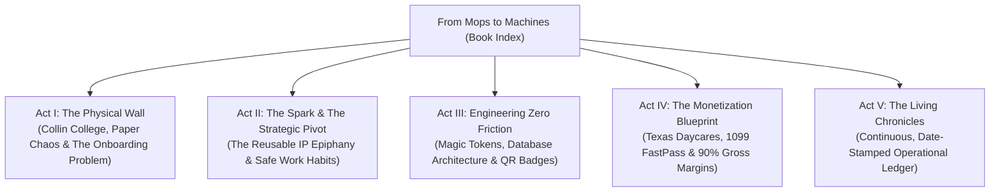

# From Mops to Machines: The Creation of SigmaAcademy™
## *How an Industrial Cleaning Company Engineered a Zero-Friction Software & Credentialing Engine*

---

### Executive Metadata & Document Control
- **Document Title:** From Mops to Machines: The Creation of SigmaAcademy™
- **Publication ID:** `HWB-ACADEMY-BOOK-001`
- **Permanent Archive:** `HWB-COMPANY/HWB-ACADEMY/THE-SIGMA-ACADEMY-CHRONICLES/`
- **QMS Controlled Manual:** `hwb-qms-book-01_from_mops_to_machines_the_creation_of_sigma_academy.html`
- **Executive Authority:** Humberto Dominguez, Chief Executive Officer
- **Systems Architect & Author:** George (Senior Software Engineer, PhD in Business, mbB)
- **Effective Release Date:** September 19, 2026 (Updated October 01, 2026)
- **Version:** 1.2.0 (Living Neural Edition)

---

### Dedication & Philosophy
> *"True industrial mastery is not about working harder with your hands; it is about relentlessly eliminating friction with your mind until the entire process runs with zero defects."*  
> — **Humberto Dominguez, CEO, HWB Cleaning Services LLC**

This work chronicles the real-world operational and technological journey of HWB Cleaning Services LLC. It records how an ambitious commercial cleaning enterprise, operating across the high-velocity Dallas-Fort Worth metroplex, encountered the raw logistical chaos of high employee turnover, paper binder compliance, and jobsite safety risks—and chose to solve it not with more paper, but with code.

From the crucible of the Collin College Frisco Campus proposal to the invention of single-use magic tokens, this book serves as both a historical record and a living operational blueprint for building high-margin digital leverage out of blue-collar service operations.

---

### Master Table of Contents

1. **[Act I: The Physical Wall](01_ACT_I_THE_PHYSICAL_WALL.md)** — The 478,000 SF Collin College challenge, the statutory mandates of Texas Education Code § 22.0834, and why traditional commercial cleaning onboarding fails.
2. **[Act II: The Spark & The Strategic Pivot](02_ACT_II_THE_SPARK_AND_PIVOT.md)** — The pivotal question from CEO Humberto Dominguez that shifted HWB from a commodity labor provider into an intellectual property producer.
3. **[Act III: Engineering Zero Friction](03_ACT_III_ENGINEERING_ZERO_FRICTION.md)** — Solving the password paradox, architecting the PostgreSQL multi-tenant schema, and deploying mobile QR verification badges.
4. **[Act IV: The Monetization Blueprint](04_ACT_IV_THE_MONETIZATION_BLUEPRINT.md)** — Packaging commercial cleaning expertise into recurring SaaS and pass-through certification streams.
5. **[Act V: The Living Chronicles](05_ACT_V_THE_LIVING_CHRONICLES.md)** — The real-time, dated audit trail documenting ongoing releases, milestones, and expansion.
