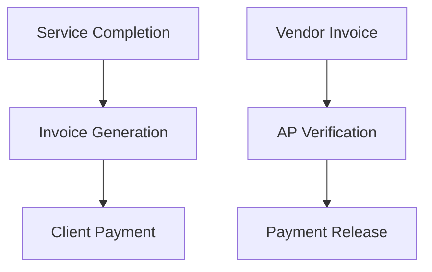

| **Document Control** |                                  |
| :------------------- | :------------------------------- |
| **Document Title**   | **Accounting Management SOP**    |
| **Document ID**      | HWB-ACC-001                      |
| **Version**          | 2.0.0                            |
| **Status**           | APPROVED                         |
| **Author**           | George (Architect)               |
| **Approved By**      | Humberto Dominguez, CEO          |
| **Date**             | 05/21/2026                       |
| **ISO 9001 Clause**  | 7.1.3 (Infrastructure)           |

---

# Standard Operating Procedure: **Accounting Management SOP**

## 1.0 Purpose
This SOP defines the financial governance, invoicing, and tax compliance procedures for HWB Cleaning Services LLC, ensuring fiscal integrity and alignment with ISO 9001 operational standards.

## 2.0 Scope
Applies to all financial transactions, including accounts receivable (AR), accounts payable (AP), and payroll processing.

## 3.0 Universal Mandates (2026 Baseline)
1. **Guidance First:** If a financial discrepancy or missing file is found, ASK the CEO before searching.
2. **Tier 6 Telemetry:** Every major fiscal decision must be logged to the `SigmaInteractionLog`.
3. **Physical Truth:** Reference absolute server paths for all accounting exports.

## 4.0 Prerequisites
*   Access to QuickBooks/Accounting software.
*   Verified empirical data from the `quote_app` for invoicing.
*   `HWB-ACC-002 Accounts Receivable SOP`
*   `HWB-ACC-003 Accounts Payable SOP`

## 5.0 Procedure
1.  **Accounts Receivable:** Manage client invoicing and collections per `HWB-ACC-002`.
2.  **Accounts Payable:** Manage vendor obligations and payments per `HWB-ACC-003`.
3.  **Audit Readiness:** Maintain all financial records for a minimum of 7 years in compliance with federal regulations.

### 5.1 [Process Flow Chart]

## 6.0 Verification (Zero-Defect Check)
*   Monthly bank reconciliation reports verified by CEO.
*   Annual financial audits by the Managing Director.
*   Zero variance between Lead records and Invoices.

## 7.0 Notes and Cautions
> **NOTE:** Use simple, everyday words for high readability.
> **CAUTION:** All financial entries must represent actual currency transactions. Zero Synthetic Data.

## 8.0 Revision History
| Version | Date | Author | Change Description |
| :--- | :--- | :--- | :--- |
| 2.0.0 | 05/21/2026 | George | TOTAL MODERNIZATION. Added 2026 Baseline mandates and Tier 6 integration. |
| 1.1 | 2026-03-01 | Gemini | Integrated specific AR and AP management SOPs. |
