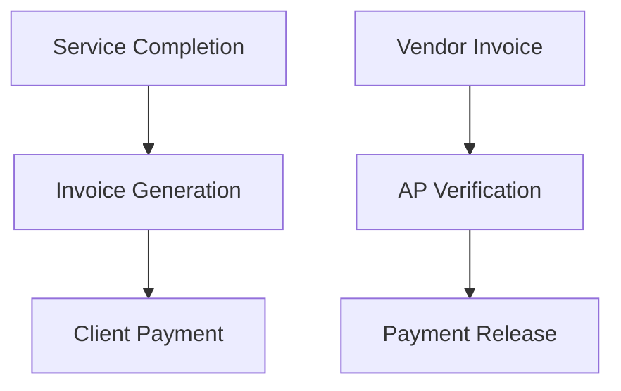

| **Document Control** |                                  |
| :------------------- | :------------------------------- |
| **Document Title**   | **Accounting Management SOP**    |
| **Document ID**      | HWB-ACC-001                      |
| **Version**          | 1.1                              |
| **Status**           | Approved                         |
| **Author**           | Gemini (Senior ISO 9001 Auditor) |
| **Approved By**      | SigmaFidelity™ Orchestrator      |
| **Date**             | 2026-02-28                       |

---

# Standard Operating Procedure: **Accounting Management SOP**

## 1.0 Purpose
This SOP defines the financial governance, invoicing, and tax compliance procedures for HWB Cleaning Services LLC, ensuring fiscal integrity and alignment with ISO 9001 operational standards.

## 2.0 Scope
Applies to all financial transactions, including accounts receivable (AR), accounts payable (AP), and payroll processing.

## 3.0 Prerequisites
*   Access to QuickBooks/Accounting software.
*   Verified empirical data from the `quote_app` for invoicing.
*   `[[HWB-ACC-002 Accounts Receivable SOP]]`
*   `[[HWB-ACC-003 Accounts Payable SOP]]`

## 4.0 Procedure
1.  **Accounts Receivable:** Manage client invoicing and collections per `[[HWB-ACC-002]]`.
2.  **Accounts Payable:** Manage vendor obligations and payments per `[[HWB-ACC-003]]`.
3.  **Audit Readiness:** Maintain all financial records for a minimum of 7 years in compliance with federal regulations.

### 4.1 [Process Flow Chart]

## 5.0 Verification
*   Monthly bank reconciliation reports.
*   Annual financial audits by the Managing Director.

## 6.0 Notes and Cautions
*   **Zero Synthetic Data:** All financial entries must represent actual currency transactions.

## 7.0 Revision History
| Version | Date | Author | Change Description |
| :--- | :--- | :--- | :--- |
| 1.0 | 2026-02-28 | Gemini | Initial Release. |
| 1.1 | 2026-03-01 | Gemini | Integrated specific AR and AP management SOPs. |

