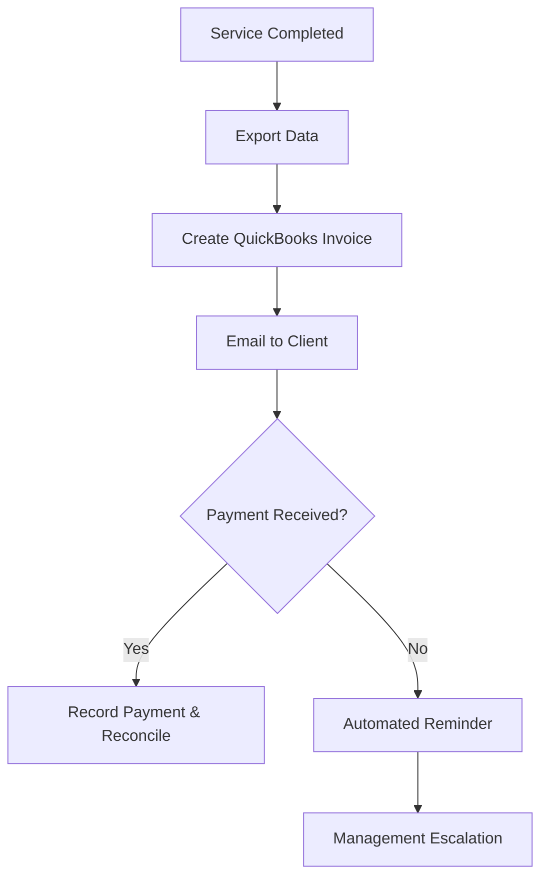

| **Document Control** |                                  |
| :------------------- | :------------------------------- |
| **Document Title**   | **Accounts Receivable (AR) SOP** |
| **Document ID**      | HWB-ACC-002                      |
| **Version**          | 2.0.0                            |
| **Status**           | APPROVED                         |
| **Author**           | George (Architect)               |
| **Approved By**      | Humberto Dominguez, CEO          |
| **Date**             | 05/21/2026                       |
| **ISO 9001 Clause**  | 8.2.1 (Customer Communication)   |

---

# Standard Operating Procedure: **Accounts Receivable (AR) Management**

## 1.0 Purpose
To define the procedure for generating client invoices, tracking payments, and managing collections using QuickBooks. This ensures cash flow stability and accurate empirical financial reporting.

## 2.0 Scope
Applies to all revenue-generating activities, specifically service quotes and work orders processed via the Lead Pipeline and finalized in QuickBooks.

## 3.0 Universal Mandates (2026 Baseline)
1. **Guidance First:** If a payment is missing or a file is lost, ASK the CEO before consuming tokens on a search.
2. **Tier 6 Telemetry:** Log all major AR adjustments to the `SigmaInteractionLog`.
3. **Physical Truth:** Use absolute paths for all data exports.

## 4.0 Prerequisites
*   Verified service completion data from the Lead Pipeline.
*   QuickBooks Online/Desktop access.
*   Approved Client Master File.

## 5.0 Procedure

### 5.1 Invoice Generation
1.  **Data Verification:** At the end of each service week, export the "Completed Services" report.
2.  **QuickBooks Entry:** Create a new invoice in QuickBooks for each client based on the empirical quote number and service date.
3.  **Accuracy Check:** Ensure sales tax rates are correctly applied based on the client's North Texas jurisdiction.
4.  **Distribution:** Send invoices via email directly from QuickBooks.

### 5.2 Payment Application
1.  **Recording:** Upon receipt of payment (ACH, Check, or Credit Card), record the transaction against the specific invoice in QuickBooks.
2.  **Reconciliation:** Daily matching of bank deposits to QuickBooks payment records.

### 5.3 Collections & Aging
1.  **Review:** Weekly review of the "A/R Aging Detail" report.
2.  **Follow-up:** 
    *   **Net 30+:** Send a polite automated reminder.
    *   **Net 60+:** Direct contact by the Operations Manager.

### 5.4 [Process Flow Chart]

## 6.0 Verification (Zero-Defect Check)
*   Monthly AR Aging Report signed by the Managing Director.
*   Zero variance between system completions and QuickBooks invoices.
*   All client data matches the "Source of Truth" Client Master File.

## 7.0 Notes and Cautions
> **NOTE:** Maintain a professional and helpful tone during collection calls.
> **CAUTION:** Never generate placeholder invoices. All billing must be based on real work.

## 8.0 Revision History
| Version | Date | Author | Change Description |
| :--- | :--- | :--- | :--- |
| 2.0.0 | 05/21/2026 | George | TOTAL MODERNIZATION. Added 2026 Baseline mandates and Tier 6 integration. |
| 1.0 | 2026-03-01 | Gemini | Initial Release. |
