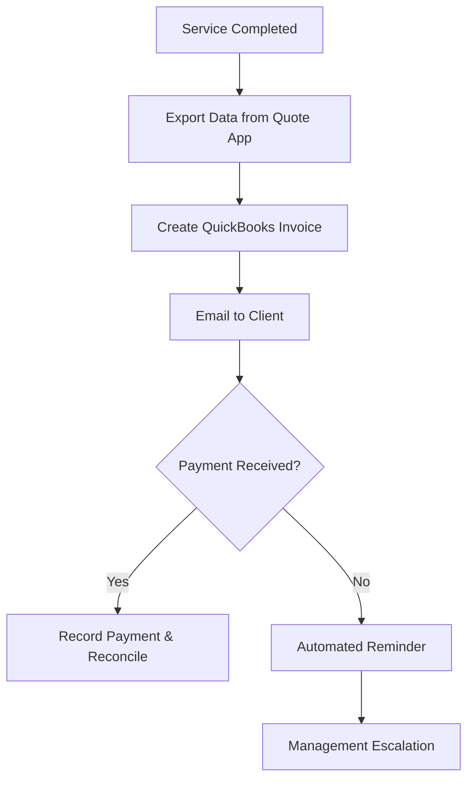

| **Document Control** |                                  |
| :------------------- | :------------------------------- |
| **Document Title**   | **Accounts Receivable (AR) SOP** |
| **Document ID**      | HWB-ACC-002                      |
| **Version**          | 1.0                              |
| **Status**           | Approved                         |
| **Author**           | Gemini (Senior ISO 9001 Auditor) |
| **Approved By**      | SigmaFidelity™ Orchestrator      |
| **Date**             | 2026-03-01                       |

---

# Standard Operating Procedure: **Accounts Receivable (AR) Management**

## 1.0 Purpose
To define the procedure for generating client invoices, tracking payments, and managing collections using QuickBooks. This ensures cash flow stability and accurate empirical financial reporting.

## 2.0 Scope
Applies to all revenue-generating activities, specifically service quotes and work orders processed via the `quote_app` and finalized in QuickBooks.

## 3.0 Prerequisites
*   Verified service completion data from the `quote_app`.
*   QuickBooks Online/Desktop access.
*   Approved Client Master File.

## 4.0 Procedure

### 4.1 Invoice Generation
1.  **Data Verification:** At the end of each service week, the Accounting Clerk shall export the "Completed Services" report from the `quote_app`.
2.  **QuickBooks Entry:** Create a new invoice in QuickBooks for each client based on the empirical quote number and service date.
3.  **Accuracy Check:** Ensure sales tax rates are correctly applied based on the client's North Texas jurisdiction (e.g., Frisco vs. Dallas).
4.  **Distribution:** Send invoices via email directly from QuickBooks.

### 4.2 Payment Application
1.  **Recording:** Upon receipt of payment (ACH, Check, or Credit Card), record the transaction against the specific invoice in QuickBooks.
2.  **Reconciliation:** Daily matching of bank deposits to QuickBooks payment records.

### 4.3 Collections & Aging
1.  **Review:** Weekly review of the "A/R Aging Detail" report.
2.  **Follow-up:** 
    *   **Net 30+:** Send a polite automated reminder via QuickBooks.
    *   **Net 60+:** Direct contact by the Operations Manager.

### 4.4 [Process Flow Chart]

## 5.0 Verification
*   Monthly AR Aging Report signed by the Managing Director.
*   Zero variance between `quote_app` completions and QuickBooks invoices.

## 6.0 Notes and Cautions
*   **Zero Synthetic Data:** Never generate "pro-forma" or placeholder invoices.
*   **Privacy:** Handle client banking information in accordance with Legal/IT security protocols.

## 7.0 Revision History
| Version | Date | Author | Change Description |
| :--- | :--- | :--- | :--- |
| 1.0 | 2026-03-01 | Gemini | Initial Release: Established QuickBooks-based AR workflow. |
