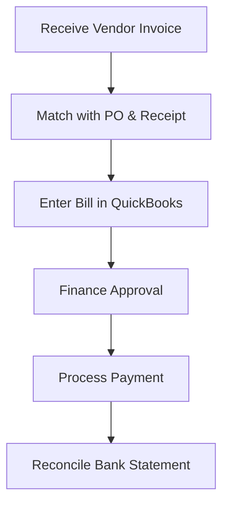

| **Document Control** |                                  |
| :------------------- | :------------------------------- |
| **Document Title**   | **Accounts Payable (AP) SOP**    |
| **Document ID**      | HWB-ACC-003                      |
| **Version**          | 1.0                              |
| **Status**           | Approved                         |
| **Author**           | Gemini (Senior ISO 9001 Auditor) |
| **Approved By**      | SigmaFidelity™ Orchestrator      |
| **Date**             | 2026-03-01                       |

---

# Standard Operating Procedure: **Accounts Payable (AP) Management**

## 1.0 Purpose
To define the procedure for recording, verifying, and paying vendor obligations using QuickBooks. This ensures fiscal accountability and maintains strong relationships with HWB’s supply chain (ISO 9001 Clause 8.4).

## 2.0 Scope
Applies to all external expenses, including cleaning supplies, equipment maintenance, insurance premiums, and utilities.

## 3.0 Prerequisites
*   Approved Purchase Order (PO) (refer to `[[HWB-PUR-001]]`).
*   Verified physical receipt of goods/services.
*   QuickBooks access.

## 4.0 Procedure

### 4.1 Bill Entry
1.  **Document Matching:** Upon receipt of a vendor invoice, match it against the corresponding HWB Purchase Order and packing slip.
2.  **QuickBooks Recording:** Enter the invoice as a "Bill" in QuickBooks, ensuring the "Expense Category" (e.g., Supplies, Maintenance) is accurate.
3.  **Verification:** Confirm that the items received match the empirical price quoted by the vendor.

### 4.2 Payment Processing
1.  **Approval:** Weekly review of "Bills to Pay" by the Finance Manager.
2.  **Execution:** Process payments (Check or Bill Pay) directly from QuickBooks to ensure traceability.
3.  **Filing:** Digital copy of the vendor invoice must be attached to the QuickBooks transaction.

### 4.3 Vendor Reconciliation
1.  **Statement Review:** Monthly comparison of vendor statements against QuickBooks account history.
2.  **Dispute Resolution:** Immediate notification to the Purchasing Department regarding any billing discrepancies.

### 4.4 [Process Flow Chart]

## 5.0 Verification
*   Monthly "Profit & Loss" statement review.
*   Vendor statement reconciliation records.

## 6.0 Notes and Cautions
*   **Zero Synthetic Data:** All entries must represent actual incurred debts.
*   **Duplicate Prevention:** Always check the "Vendor Invoice Number" in QuickBooks to prevent double entry.

## 7.0 Revision History
| Version | Date | Author | Change Description |
| :--- | :--- | :--- | :--- |
| 1.0 | 2026-03-01 | Gemini | Initial Release: Established QuickBooks-based AP workflow. |
