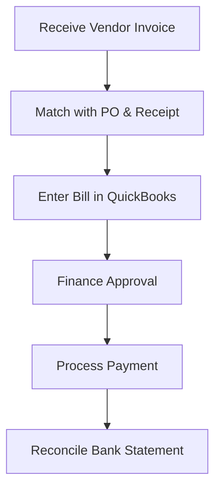

| **Document Control** |                                  |
| :------------------- | :------------------------------- |
| **Document Title**   | **Accounts Payable (AP) SOP**    |
| **Document ID**      | HWB-ACC-003                      |
| **Version**          | 2.0.0                            |
| **Status**           | APPROVED                         |
| **Author**           | George (Architect)               |
| **Approved By**      | Humberto Dominguez, CEO          |
| **Date**             | 05/21/2026                       |
| **ISO 9001 Clause**  | 8.4 (Control of External)        |

---

# Standard Operating Procedure: **Accounts Payable (AP) Management**

## 1.0 Purpose
To define the procedure for recording, verifying, and paying vendor obligations using QuickBooks. This ensures fiscal accountability and maintains strong relationships with HWB’s supply chain.

## 2.0 Scope
Applies to all external expenses, including cleaning supplies, equipment maintenance, insurance premiums, and utilities.

## 3.0 Universal Mandates (2026 Baseline)
1. **Guidance First:** If a vendor invoice is missing, ASK the CEO before searching the filesystem.
2. **Tier 6 Telemetry:** Every payment approval must be traceable in the system interaction logs.
3. **Physical Truth:** Reference absolute server paths for all digital copies of invoices.

## 4.0 Prerequisites
*   Approved Purchase Order (refer to `HWB-PUR-001`).
*   Verified physical receipt of goods/services.
*   QuickBooks access.

## 5.0 Procedure

### 5.1 Bill Entry
1.  **Document Matching:** Upon receipt of a vendor invoice, match it against the corresponding HWB Purchase Order and packing slip.
2.  **QuickBooks Recording:** Enter the invoice as a "Bill" in QuickBooks, ensuring the "Expense Category" (e.g., Supplies, Maintenance) is accurate.
3.  **Verification:** Confirm that the items received match the empirical price quoted by the vendor.

### 5.2 Payment Processing
1.  **Approval:** Weekly review of "Bills to Pay" by the Finance Manager.
2.  **Execution:** Process payments directly from QuickBooks to ensure 100% traceability.
3.  **Filing:** Digital copy of the vendor invoice must be attached to the transaction record.

### 5.3 Vendor Reconciliation
1.  **Statement Review:** Monthly comparison of vendor statements against QuickBooks account history.
2.  **Dispute Resolution:** Immediate notification to the Purchasing Department regarding any billing discrepancies.

### 5.4 [Process Flow Chart]

## 6.0 Verification (Zero-Defect Check)
*   Monthly "Profit & Loss" statement review.
*   Vendor statement reconciliation records verified.
*   Zero variance between physical receipts and digital entries.

## 7.0 Notes and Cautions
> **NOTE:** Use everyday words when communicating with vendors about discrepancies.
> **CAUTION:** Check the "Vendor Invoice Number" to prevent double entry. No synthetic debt records.

## 8.0 Revision History
| Version | Date | Author | Change Description |
| :--- | :--- | :--- | :--- |
| 2.0.0 | 05/21/2026 | George | TOTAL MODERNIZATION. Added 2026 Baseline mandates and Tier 6 integration. |
| 1.0 | 2026-03-01 | Gemini | Initial Release. |
