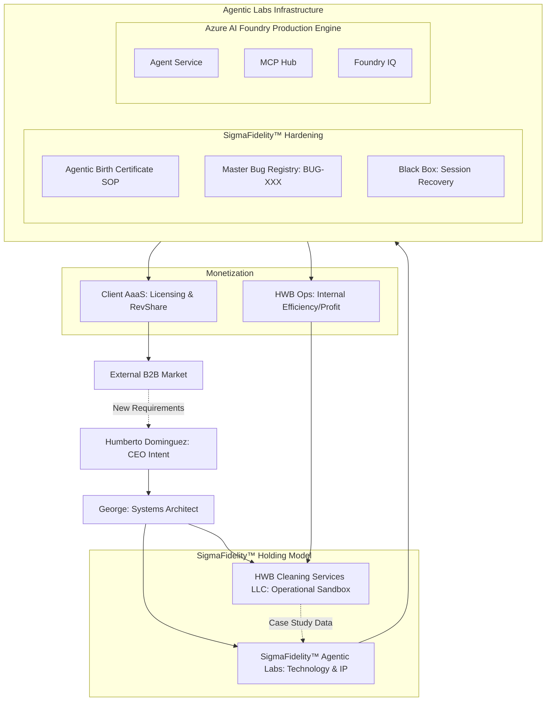

# SigmaFidelity™ Agentic Infrastructure Flowchart
**Status:** Living Document - Brainstorm Version 1.3.0
**Last Updated:** 04/27/2026 by George

---

## Evolution Log: 04/27/2026 Session
- **Strategic Pivot:** Established **SigmaFidelity™ Agentic Labs** as a separate corporate division to segregate tech IP from HWB physical operations.
- **Infrastructure:** Initialized the "Peter/George" hybrid model.
- **Platform:** Identified **Azure AI Foundry** as the primary production engine.
- **Monetization:** Defined "SigmaQuote™" AaaS model with tiered RevShare.

---
*Note: This flowchart is renderable via Mermaid.js in Obsidian or VS Code.*
