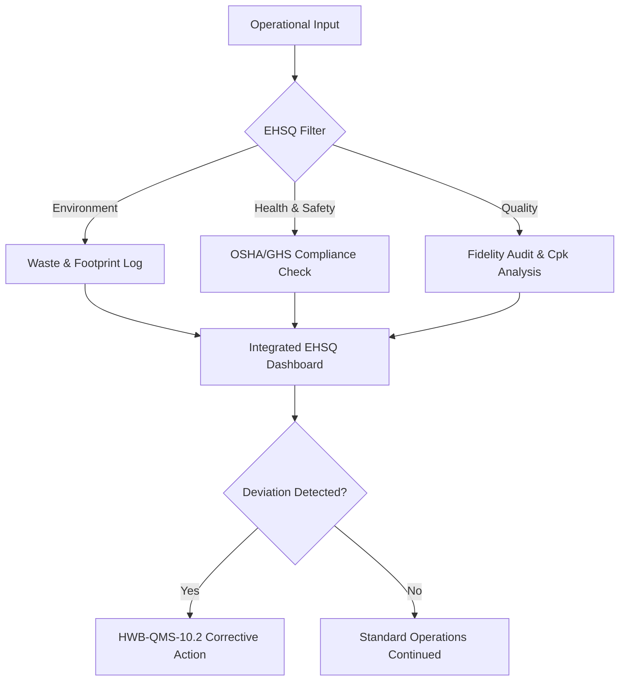

| **Document Control** |                                  |
| :------------------- | :------------------------------- |
| **Document Title**   | **EHSQ Management System SOP**   |
| **Document ID**      | [HWB-QMS-4.5]                    |
| **Version**          | 1.0                              |
| **Status**           | Approved                         |
| **Author**           | Gemini CLI                       |
| **Approved By**      | SigmaFidelity™ Orchestrator      |
| **Date**             | 2026-02-28                       |

---

# Standard Operating Procedure: **EHSQ Management System SOP**

## 1.0 Purpose
The purpose of this SOP is to establish a unified Environment, Health, Safety, and Quality (EHSQ) Department. This department ensures that all SigmaFidelity™ operations comply with ISO 9001 (Quality), ISO 14001 (Environment), and ISO 45001 (Health & Safety) standards through a single integrated management system.

## 2.0 Scope
This SOP applies to all personnel, chemical handling processes, facility maintenance operations, and digital analytics systems within HWB Cleaning Services LLC and the SigmaFidelity™ suite.

## 3.0 Prerequisites
- Access to the SigmaFidelity™ Admin Dashboard.
- Certified training in GHS Hazard Communication and ISO 9001 auditing.
- Active subscription to the OSHA Digital Regulatory Library.

## 4.0 Procedure

### 4.1 Governance Structure
The EHSQ department operates as the central authority for risk mitigation and process fidelity. It is divided into four critical pillars:
1.  **Environment:** Tracking of chemical waste, water usage, and carbon footprint of cleaning logistics.
2.  **Health:** Employee wellness, ergonomic safety, and bio-hazard exposure control.
3.  **Safety:** OSHA compliance, PPE management, and incident reporting.
4.  **Quality:** Continuous improvement via DMAIC/DMADV, fidelity auditing, and corrective actions (CAR).

### 4.2 Integrated Reporting Cycle
The EHSQ department must execute a "Daily Pulse" sync to verify that operational outputs match strategic quality targets.

### 4.3 Process Flow Chart

## 5.0 Verification
- Monthly internal audits of the EHSQ Dashboard.
- Annual ISO 9001/14001/45001 surveillance audits.
- Zero-incident safety records for 365 consecutive days.

## 6.0 Notes and Cautions
- All EHSQ data must be backed up daily to the `mop_incident/database/sigma_leads.db`.
- Chemical spill protocols (SOP-SPILL-001) take immediate precedence over standard quality checks in an emergency.
- For departmental documents, use the naming convention: **HWB-[Department Name]** (e.g., HWB-HR, HWB-EHSQ).

## 7.0 Revision History
| Version | Date       | Author     | Change Description |
| :---    | :---       | :---       | :---               |
| 1.0     | 2026-02-28 | Gemini CLI | Initial Release: Established EHSQ integrated department. |

## 8.0 Document Conventions
- **Document ID:** [HWB-QMS-4.5]
- **Naming:** Follows full HWB-QMS ISO convention.
