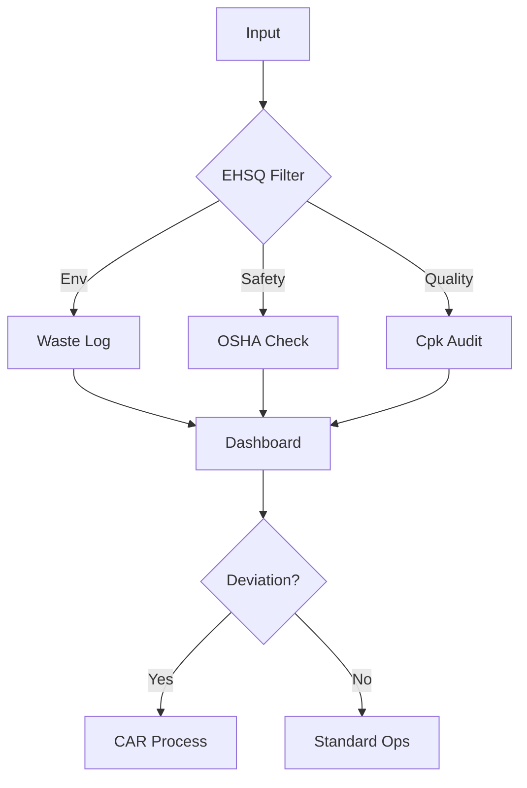

| **Document Control** |                                  |
| :------------------- | :------------------------------- |
| **Document Title**   | **EHSQ Management System SOP**   |
| **Document ID**      | HWB-QMS-4.5                      |
| **Version**          | 2.0.0                            |
| **Status**           | APPROVED                         |
| **Author**           | George (Architect)               |
| **Approved By**      | Humberto Dominguez, CEO          |
| **Date**             | 05/21/2026                       |
| **ISO 9001 Clause**  | 7.1.3 (Infrastructure)           |

---

# Standard Operating Procedure: **EHSQ Management System SOP**

## 1.0 Purpose
This SOP establishes the unified Environment, Health, Safety, and Quality (EHSQ) Department. It ensures all SigmaFidelity™ operations comply with ISO 9001, ISO 14001, and ISO 45001 standards through an integrated industrial framework.

## 2.0 Scope
Applies to all HWB personnel, chemical handling, and digital analytics systems.

## 3.0 Universal Mandates (2026 Baseline)
1. **Guidance First:** If a safety risk is unmapped, ASK the CEO before proceeding.
2. **Tier 6 Telemetry:** Every incident and safety audit must be logged.
3. **Physical Truth:** Use absolute paths for SDS (Safety Data Sheet) digital repositories.

## 4.0 Procedure

### 4.1 Pillars of Control
1. **Environment:** Carbon footprint and chemical lifecycle management.
2. **Health:** Bio-hazard control and ergonomic wellness.
3. **Safety:** PPE management and OSHA reporting.
4. **Quality:** Continuous improvement via DMAIC and fidelity auditing.

### 4.2 Workflow

## 5.0 Verification (Zero-Defect Check)
* Monthly internal audits of the EHSQ Dashboard.
* Zero-incident safety records for 365 consecutive days.

## 6.0 Notes and Cautions
> **CAUTION:** Chemical spill protocols take immediate precedence over standard work.
> **LOGIC:** EHSQ data is backed up daily via Peter Sentinel.

## 7.0 Revision History
| Version | Date | Author | Change Description |
| :--- | :--- | :--- | :--- |
| 2.0.0 | 05/21/2026 | George | TOTAL MODERNIZATION. Added 2026 Baseline and Microservice integration. |
| 1.0 | 2026-02-28 | Gemini | Initial Release. |
