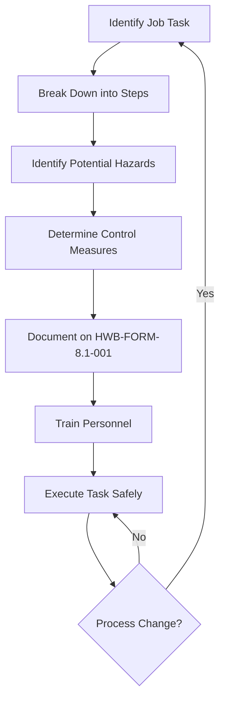

| **Document Control** |                                  |
| :------------------- | :------------------------------- |
| **Document Title**   | **Job Hazard Analysis SOP**      |
| **Document ID**      | [HWB-QMS-8.1-001]                |
| **Version**          | 1.0                              |
| **Status**           | Approved                         |
| **Author**           | Gemini CLI                       |
| **Approved By**      | SigmaFidelity™ Orchestrator      |
| **Date**             | 2026-02-28                       |

---

# Standard Operating Procedure: **Job Hazard Analysis SOP**

## 1.0 Purpose
The purpose of this SOP is to provide a standardized method for identifying, evaluating, and controlling workplace hazards before a task is performed. This process (JHA) is a core component of the SigmaFidelity™ EHSQ department and ensures compliance with OSHA 29 CFR 1910 and ISO 45001.

## 2.0 Scope
This SOP applies to all HWB Cleaning Services LLC operations, including janitorial management, floor restoration, and chemical handling. A JHA must be conducted for any new task, high-risk task, or when process deviations occur.

## 3.0 Prerequisites
- Access to **HWB-FORM-8.1-001 Job Hazard Analysis (JHA) Form**.
- Personal Protective Equipment (PPE) as defined in the Chemical SDS.
- Training in Hazard Identification and Risk Assessment (HIRA).

## 4.0 Procedure

### 4.1 Task Selection and Breakdown
1. Select the job or task to be analyzed.
2. Break the task down into a sequence of basic steps.
3. Observe the task being performed or utilize experienced personnel to describe the steps.

### 4.2 Hazard Identification
1. For each step, identify potential hazards (e.g., slips, chemical exposure, ergonomic strain, electrical risk).
2. Consider environment, equipment, and personnel interactions.

### 4.3 Risk Control Development
1. Develop preventive measures for each identified hazard.
2. Follow the Hierarchy of Controls:
   - **Elimination:** Remove the hazard.
   - **Substitution:** Use a safer alternative (e.g., Low-VOC chemicals).
   - **Engineering Controls:** Isolate people from the hazard.
   - **Administrative Controls:** Change the way people work (e.g., SOPs, signs).
   - **PPE:** Protect the worker with equipment.

### 4.4 Documentation and Training
1. Record findings on **HWB-FORM-8.1-001**.
2. Review the JHA with all employees involved in the task.
3. Ensure the Personnel Sign-off section includes:
   - Employee Name
   - Shift (1st, 2nd, 3rd)
   - Status (Full-time, Part-time, Contractor)
   - Certification status for critical equipment:
     - Forklift and Hopper
     - S20 (Scrubber)
     - M20 (Scrubber-Sweeper)
     - Other (Specify)
4. Obtain necessary approvals from the EHSQ Department.

### 4.5 Process Flow Chart

## 5.0 Verification
- JHA forms must be audited monthly by the EHSQ Lead.
- Field supervisors must verify on-site compliance with JHA control measures during random safety inspections.

## 6.0 Notes and Cautions
- **NEVER** perform a high-risk task without a completed and signed JHA.
- If a near-miss occurs, the JHA for that task must be immediately revised.

## 7.0 Revision History
| Version | Date       | Author     | Change Description |
| :---    | :---       | :---       | :---               |
| 1.0     | 2026-02-28 | Gemini CLI | Initial Release: Standardized JHA workflow. |

## 8.0 Document Conventions
- **Document ID:** [HWB-QMS-8.1-001]
- **Form Association:** Requires HWB-FORM-8.1-001.
