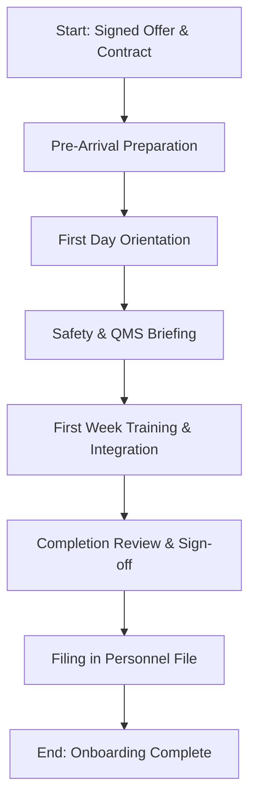

| **Document Control** |                                      |
| :------------------- | :----------------------------------- |
| **Document Title**   | **Employee Onboarding SOP**          |
| **Document ID**      | HWB-QMS-7.2                          |
| **Version**          | 1.0                                  |
| **Status**           | Approved                             |
| **Author**           | Gemini                               |
| **Approved By**      | Operations & HR Manager              |
| **Date**             | 2026-02-28                           |

---

# Standard Operating Procedure: **Employee Onboarding SOP**

## 1.0 Purpose

This SOP defines the standardized procedure for the integration of new employees into HWB Cleaning Services LLC. The objective is to ensure that all personnel are adequately prepared, equipped, and informed of the company's Quality Management System (QMS), safety protocols, and operational expectations from their first day of employment.

## 2.0 Scope

This procedure applies to all new hires, permanent and temporary, and all management personnel responsible for the onboarding process at HWB Cleaning Services LLC.

## 3.0 Prerequisites

*   Signed Offer Letter and Employment Contract.
*   Approved Job Description (refer to `[[HWB-FORM-7.2-001 Job Description Template]]`).
*   Verified eligibility for employment (refer to `[[HWB-FORM-7.2-004 Employee File Checklist]]`).

## 4.0 Procedure

### 4.1 Pre-Arrival Preparation (HR/Operations)

1.  **Workspace Allocation:** Assign a workspace or vehicle, as applicable to the role.
2.  **Equipment Procurement:** Ensure all necessary tools, equipment, and PPE are available.
3.  **Digital Access:** Create company email accounts, database access (e.g., `quote_app`), and other required software credentials.
4.  **Onboarding Kit:** Prepare the `[[HWB-FORM-7.2-005 Employee Onboarding Form]]` and the Employee Handbook.

### 4.2 First Day Orientation

1.  **Welcome:** Introduce the new employee to the team and the Managing Director.
2.  **Facility Tour:** Conduct a tour of the office and storage facilities, identifying emergency exits and first-aid stations.
3.  **Safety Briefing:** Review the Job Hazard Analysis (`[[HWB-QMS-8.1-001 Job Hazard Analysis SOP]]`) relevant to the position.
4.  **Administrative Setup:** Complete and collect all outstanding HR documentation as per `[[HWB-FORM-7.2-004 Employee File Checklist]]`.

### 4.3 First Week Training and Integration

1.  **QMS Awareness:** Provide an overview of the Quality Policy, Quality Objectives, and the importance of compliance with SOPs.
2.  **Specific Process Training:** Initiate training for role-specific tasks (e.g., use of cleaning chemicals, equipment operation).
3.  **System Training:** Provide hands-on training for the `quote_app` or other internal management tools if required.
4.  **Mentorship:** Assign a mentor for the first week to provide guidance on company culture and daily routines.

### 4.4 Completion and Sign-off

1.  **Review:** Meet with the employee at the end of the first week to address any questions.
2.  **Verification:** Ensure all items on the `[[HWB-FORM-7.2-005 Employee Onboarding Form]]` are checked and signed.
3.  **Filing:** File the completed onboarding form in the employee's information file.

### 4.5 [Process Flow Chart]

## 5.0 Verification

*   Successful completion of the `[[HWB-FORM-7.2-005 Employee Onboarding Form]]`.
*   Establishment of the Employee Information File with all required documentation.
*   Successful login and initial use of company systems.

## 6.0 Notes and Cautions

*   The onboarding process is a critical touchpoint for long-term employee retention and service quality.
*   Confidentiality must be maintained regarding personal information collected during the process.

## 7.0 Revision History

| Version | Date | Author | Change Description |
| :--- | :--- | :--- | :--- |
| 1.0 | 2026-02-28 | Gemini | Initial Release |
| 1.1 | 2026-02-28 | Gemini | Added Process Flow Chart (Mermaid) |
