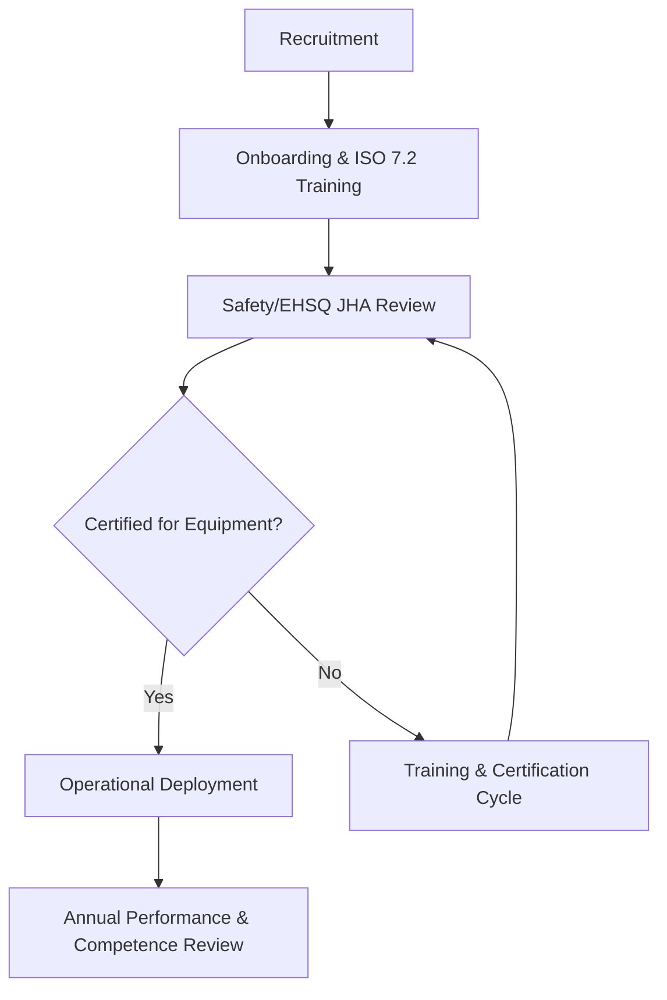

| **Document Control** |                                  |
| :------------------- | :------------------------------- |
| **Document Title**   | **HR Management System SOP**     |
| **Document ID**      | [HWB-QMS-7.2]                    |
| **Version**          | 1.0                              |
| **Status**           | Approved                         |
| **Author**           | Gemini CLI                       |
| **Approved By**      | SigmaFidelity™ Orchestrator      |
| **Date**             | 2026-02-28                       |

---

# Standard Operating Procedure: **HR Management System SOP**

## 1.0 Purpose
The purpose of this SOP is to define the structure and governance of the HWB Human Resources (HR) Department. This ensures that all personnel are recruited, trained, and certified according to ISO 9001:2015 (Clause 7.2 - Competence) and SigmaFidelity™ safety standards.

## 2.0 Scope
This SOP applies to all HWB Cleaning Services LLC personnel, including recruitment, onboarding, training records, and certification management.

## 3.0 Prerequisites
- Access to the `hr` document repository.
- Standardized HWB-QMS forms for training and competence.
- EHSQ department coordination for safety-critical certifications.

## 4.0 Procedure

### 4.1 Personnel File Management
1. Maintain a secure file for each employee (HWB-FORM-7.2-004).
2. Store all certifications (Forklift, S20, M20, etc.) and JHA sign-offs.

### 4.2 Training & Competence (ISO 7.2)
1. Identify necessary competence for each role (HWB-FORM-7.2-001).
2. Execute and document training (HWB-FORM-7.2-003).
3. Verify effectiveness through supervisor evaluation and EHSQ audit.

### 4.3 Certification Tracking
1. All equipment operators must be certified before task assignment.
2. Certifications must be recorded on Job Hazard Analysis (JHA) forms.

### 4.4 Process Flow Chart

## 5.0 Verification
- Quarterly audit of personnel files to ensure 100% certification compliance.
- Annual review of the Training Needs and Plan (HWB-FORM-7.2-002).

## 6.0 Notes and Cautions
- All personnel data must be handled with strict confidentiality.
- Safety certifications (e.g., Forklift) must be renewed according to regulatory timelines.

## 7.0 Revision History
| Version | Date       | Author     | Change Description |
| :---    | :---       | :---       | :---               |
| 1.0     | 2026-02-28 | Gemini CLI | Initial Release: Established HR governance. |

## 8.0 Document Conventions
- **Document ID:** [HWB-QMS-7.2]
- **Folder:** HWB-COMPANY/HWB-HR/
