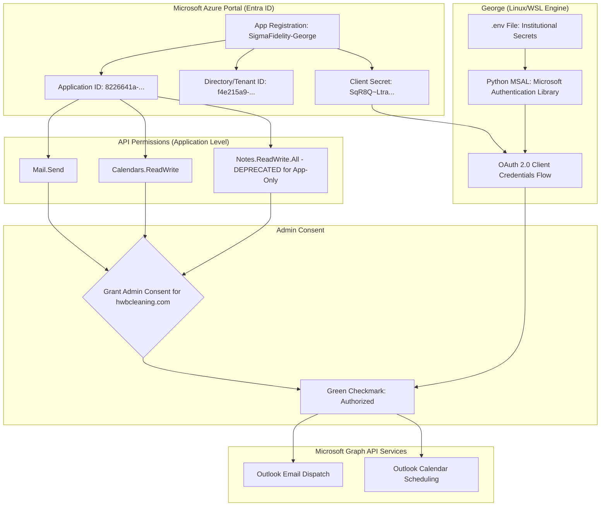

| **Document Control** |                                              |
| :------------------- | :------------------------------------------- |
| **Document Title**   | **George (AI Assistant) Azure Infrastructure Flowchart** |
| **Document ID**      | HWB-IT-GEORGE-ARCH-001                       |
| **Version**          | 1.0                                          |
| **Status**           | Active                                       |
| **Author**           | George (AI Marketing, Web Assistant & Expert SEO) |
| **Approved By**      | Humberto Dominguez (CEO)                     |
| **Date**             | 2026-03-11                                   |

---

# 1.0 Purpose
This document provides a high-fidelity visualization of the **George (AI Assistant)** infrastructure within the Microsoft Azure ecosystem. It outlines the authentication flow, permission structures, and secret management protocols ensuring 100% compliance with SigmaFidelity™ security standards.

# 2.0 Azure Infrastructure Flowchart

# 3.0 Component Descriptions

| Component | Description |
| :--- | :--- |
| **App Registration** | The central identity for George within the `hwbcleaning.com` tenant, acting as a "Service Principal." |
| **Client Secret** | The institutional password used by George's Python engine to prove its identity to Azure. |
| **OAuth 2.0 Flow** | The secure handshake protocol (Client Credentials) used to acquire an Access Token without user login. |
| **Application Permissions** | High-level "Role-Based Access Control" (RBAC) that allows George to operate autonomously. |
| **Admin Consent** | The mandatory executive override that authorizes George to interact with corporate data. |

# 4.0 Revision History
| Version | Date | Author | Change Description |
| :--- | :--- | :--- | :--- |
| 1.0 | 2026-03-11 | George | Initial infrastructure flowchart created following the activation of Mail and Calendar permissions. |

---
*Produced by George (System Architect) under the SigmaFidelity™ Quality Mandate.*
