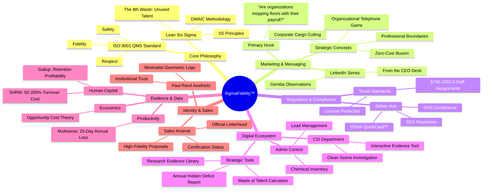

| **Document Control** | |
| :--- | :--- |
| **Document Title** | **SigmaFidelity™ Brand Evolution Mind Map** |
| **Document ID** | SIGMA-STRAT-MAP-001 |
| **Version** | 1.0 |
| **Status** | Approved |
| **Author** | Senior Strategy Agent / Professor |
| **Date** | 2026-02-21 |

---

# Strategic Mind Map: The SigmaFidelity™ Ecosystem

This document visualizes the synthesis of ISO 9001 standards, Lean Six Sigma methodologies, and the specific market strategic pivots developed for HWB Cleaning Services LLC.

## 1.0 Key Interconnections
*   **Legal-to-Sales:** Texas §746.1003.3 is the "Hook" that transforms a service inquiry into a compliance necessity.
*   **Data-to-Authority:** The Multiverse and Gallup citations move the brand from "Janitorial" to "Financial Efficiency."
*   **Philosophy-to-Brand:** Paul Rand's minimalist concepts translate our "Standard" into a visual mark of trust.

## 2.0 Revision History
| Version | Date | Author | Description |
| :--- | :--- | :--- | :--- |
| 1.0 | 2026-02-21 | Gemini | Initial Strategic Map Creation. |
