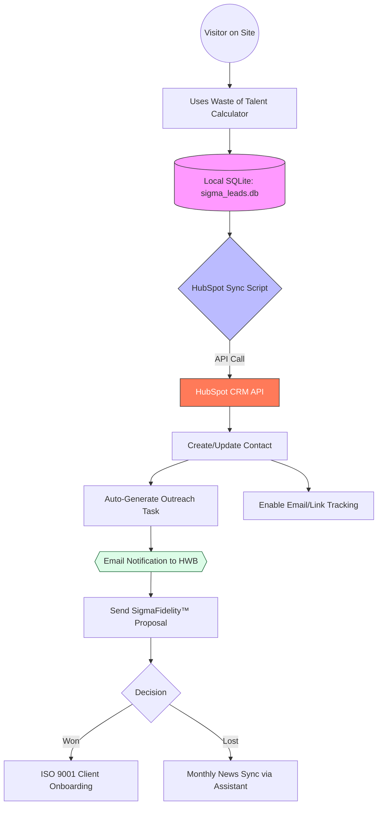

| **Document Control** | |
| :--- | :--- |
| **Document Title** | **SigmaFidelity™ / HubSpot Integration Workflow** |
| **Document ID** | SIGMA-IT-001 |
| **Version** | 1.0 |
| **Status** | Approved |
| **Author** | Marketing Assistant / IT Strategy |
| **Date** | 2026-02-21 |

---

# HubSpot Integration Workflow Chart

## 1.0 Purpose
This document defines the automated process for syncing high-intent leads from the SigmaFidelity™ digital tools directly into the HubSpot CRM for relationship management and outreach.

## 2.0 Integration Workflow Chart

## 3.0 Operational Steps
1.  **Lead Capture:** User provides email and center name in the `/calculator` tool.
2.  **Validation:** Local DB ensures data integrity and calculates the "Annual Hidden Deficit."
3.  **Sync:** The `hubspot_sync.py` script executes every hour (or on-demand), fetching new rows from `Leads`.
4.  **Enrichment:** HubSpot automatically attempts to find company logos and social profiles based on the email domain.
5.  **Tasking:** You receive a task in HubSpot titled: "Review Waste Report for [Center Name]."

## 4.0 Prerequisites for Final Launch
*   [ ] HubSpot Free Account Setup.
*   [ ] Private App Access Token generated.
*   [ ] Local `.env` file created for secure token storage.

---

## Revision History
| Version | Date | Author | Description |
| :--- | :--- | :--- | :--- |
| 1.0 | 2026-02-21 | Assistant | Initial Integration Workflow. |
