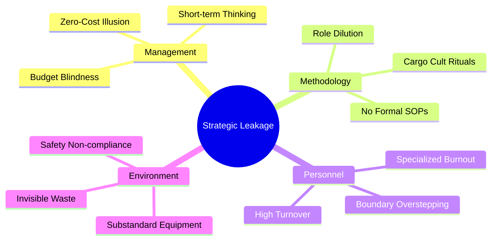

| **Document Control** | |
| :--- | :--- |
| **Document Title** | **SigmaFidelity™ Marketing Strategy & Operational Framework** |
| **Document ID** | MOP-MKT-STRAT-001 |
| **Version**           | 1.4                              |
| **Status**            | Approved                          |
| **Author**            | Senior Strategy Agent / Professor |
| **Date**              | 2026-02-21                       |

---

# Strategic Framework: SigmaFidelity™ Marketing

## 1.0 Executive Summary (The Strategic "Why")
**Master Brand:** SigmaFidelity™
**Primary Hook:** "Are organizations mopping floors with their payroll?"

SigmaFidelity™ pivots from a "Commodity Model" to a "Process Standard Model." We solve the **"Zero-Cost Illusion"**—the belief that using specialized staff for janitorial tasks is free. 

## 2.0 Root Cause Analysis (Fishbone)
To understand the **Strategic Leakage** of human capital, we categorize the causes below:

## 3.0 Branding for Interested Parties
| Party | Perception of SigmaFidelity™ | Strategic Value |
| :--- | :--- | :--- |
| **CEO/CFO** | Resource Optimization | Protection of Capital & Payroll. |
| **Parents** | The Safety Standard | Peace of mind through "Sigma-Level" hygiene. |
| **Employees** | Professional Respect | Protection of professional boundaries. |

## 4.0 The LinkedIn Launch Strategy (The "Aha!" Series)
*   **Post 1:** The Gemba visit. "Why is my son's teacher holding a mop?"
*   **Post 2:** The "Telephone Game." How a cost-cutting ritual becomes a payroll disaster.
*   **Post 3:** The SigmaFidelity™ Standard. Replacing "Cargo Cults" with Evidence-Based Management.

## 5.0 Success Metrics (KPOVs)
*   **Conversion Rate:** Waitlist sign-ups vs. total unique visitors.
*   **Lead Quality:** Percentage of verified corporate domains (Lead Fidelity).
*   **Brand Sentiment:** Organic reach on "Zero-Cost Illusion" content.

---

## Revision History
| Version | Date | Author | Description |
| :--- | :--- | :--- | :--- |
| 1.0 - 1.3 | 2026-02-21 | Gemini | Initial Strategy & Rebranding. |
| 1.4 | 2026-02-21 | Gemini | Added Strategic Leakage Fishbone diagram. |
