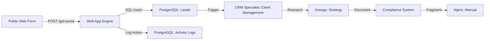

| **Document Control** |                                  |
| :------------------- | :------------------------------- |
| **Document Title**   | **Data Flow Diagram**            |
| **Document ID**      | HWB-QMS-7.5-DFD                  |
| **Version**          | 2.0.0                            |
| **Status**           | APPROVED                         |
| **Author**           | George (Architect)               |
| **Approved By**      | Humberto Dominguez, CEO          |
| **Date**             | 05/21/2026                       |
| **ISO 9001 Clause**  | 7.5.3 (Control of Information)   |

---

# Standard Operating Procedure: **Data Flow Diagram**

## 1.0 Purpose
To define the path of information through the HWB system, from the first contact to long-term storage.

## 2.0 Universal Mandates (2026 Baseline)
1. **Physical Truth:** Data flow steps show real software parts and database tables.
2. **Activity Tracking:** Every move between steps must be recorded.

## 3.0 The Data Flow Architecture

## 4.0 Verification (Error-Free Check)
*   Lead data is visible in the CRM Dashboard within <2 seconds of submission.
*   Work logs can be found in the `InteractionLog`.

## 5.0 Revision History
| Version | Date | Author | Change Description |
| :--- | :--- | :--- | :--- |
| 2.0.0 | 05/21/2026 | George | TOTAL MODERNIZATION. Integrated the Compliance Engine and Tier 6 logic. |
| 1.0 | 2026-03-02 | George | Initial DFD Release. |
