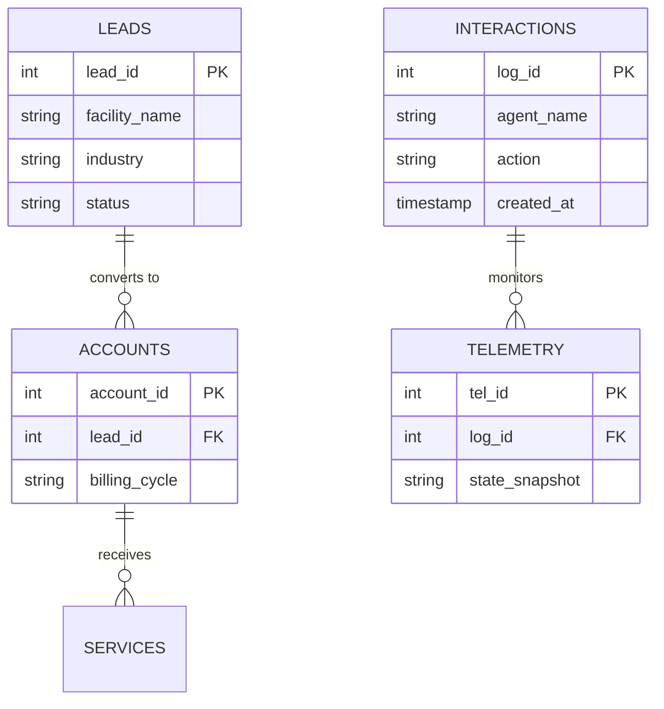

| **Document Control** |                                  |
| :------------------- | :------------------------------- |
| **Document Title**   | **Entity Relationship Diagram**  |
| **Document ID**      | HWB-QMS-7.5-ERD                  |
| **Version**          | 2.0.0                            |
| **Status**           | APPROVED                         |
| **Author**           | George (Architect)               |
| **Approved By**      | Humberto Dominguez, CEO          |
| **Date**             | 05/21/2026                       |
| **ISO 9001 Clause**  | 7.5.3 (Control of Information)   |

---

# Standard Operating Procedure: **Entity Relationship Diagram (ERD)**

## 1.0 Purpose
To define the relational database schema of the SigmaFidelity™ ecosystem. This ensuring data integrity and logical consistency across all HWB software modules.

## 2.0 Universal Mandates (2026 Baseline)
1. **Physical Truth:** Table names and keys must match the real PostgreSQL schema.
2. **Tier 6 Telemetry:** Any schema change (migration) must be logged.

## 3.0 The Database ERD

## 4.0 Verification (Zero-Defect Check)
*   Foreign keys are enforced at the database level.
*   Schema matches the `openapi.json` definition.

## 5.0 Revision History
| Version | Date | Author | Change Description |
| :--- | :--- | :--- | :--- |
| 2.0.0 | 05/21/2026 | George | TOTAL MODERNIZATION. Added Tier 6 Telemetry tables. |
| 1.0 | 2026-03-02 | George | Initial ERD Release. |
