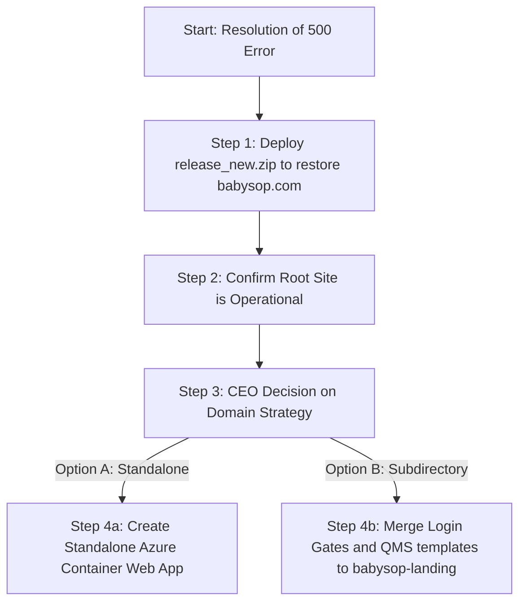

| **Document Control** | |
| :--- | :--- |
| **Document Title** | **HexGrowth Web App Deployment Audit and Publishing Strategy** |
| **Document ID** | HWB-QMS-9.6 |
| **Version** | 1.0 |
| **Status** | DRAFT |
| **Author** | George (Systems Architect) |
| **Approved By** | Humberto Dominguez, CEO |
| **Date** | 2026-06-04 |
| **ISO 9001 Clause** | 7.1.3 (Infrastructure) & 7.5 (Documented Information) |

---

# Standard Operating Procedure / Report: **HexGrowth Web App Deployment Audit and Publishing Strategy**

## 1.0 Purpose
This report audits the deployment configuration of the **HexGrowth** geospatial intelligence web application. It evaluates hosting scenarios, diagnoses the current production failures on `babysop.com`, and recommends a secure, stable, and scalable long-term publishing strategy.

## 2.0 Scope
This audit covers:
1. The **HexGrowth** codebase located at `/home/humbertoed/hexgrowth/`.
2. The **BabySOP** landing page codebase located at `/home/humbertoed/gemini_projects/HWB-COMPANY/HWB-IT/HWB-BABYSOP-LANDING/`.
3. The Azure App Service instances: `hwb-babysop-landing` and `hwb-institutional-website`.

## 3.0 Universal Mandates
All technical recommendations and actions must comply with the **SigmaFidelity™** institutional guidelines:
1. **Total Isolation:** Client applications must not share deployment files or override existing cleaning website endpoints (SOP HWB-QMS-11.7).
2. **Quality Gates:** No code changes may bypass session-based security protocols.
3. **Poka-Yoke Deployment:** Eliminate packaging errors that break live production websites.

---

## 4.0 Audit Findings

### 4.1 Production Failure Diagnosis (`www.babysop.com` / `hwb-babysop-landing`)
*   **Symptom:** The live BabySOP website (`www.babysop.com`) was returning a **500 Internal Server Error**.
*   **Root Cause:** The application log showed `jinja2.exceptions.TemplateNotFound: base.html`. An audit of the deployed zip package (`release.zip`) revealed that `base.html` was completely missing from the template directory on Azure, even though it was present in the local codebase.
*   **Resolution (In Progress):** A new package (`release_new.zip`) was compiled locally including all templates (`base.html`, `index.html`, and `hud.html`) and is currently being redeployed to Azure via the CLI.

### 4.2 Codebase Discrepancies (Local vs. Deployed Branch)
A comparison between the authoritative HexGrowth codebase (`/home/humbertoed/hexgrowth/app`) and the BabySOP-embedded route copy (`HWB-BABYSOP-LANDING`) shows significant gaps:

| Feature | Authoritative HexGrowth App (`/hexgrowth`) | Embedded BabySOP Copy (`/HWB-BABYSOP-LANDING`) |
| :--- | :--- | :--- |
| **User Authentication** | **Enabled** (Requires username/password check against `HEX_Users`) | **Disabled** (Bypasses login completely) |
| **QMS SOP Manual Viewer**| **Active** (Renders all ISO clauses from database) | **Inactive** (Renders "coming soon" placeholder) |
| **Opportunity Beacons**  | **Active** (Retrieves altitude data from `HEX_Beacons`) | **Inactive** (No database querying or API endpoint) |
| **Design System Page**   | **Active** (Interactive design documentation) | **Missing** (No route or templates) |
| **Runtime Container**    | **Dockerized** (Isolated environment via Dockerfile) | **Zip Package** (Direct Python 3.12 deployment) |

---

## 5.0 Evaluation of Deployment Options

### Option A: Standalone Subdomain Deployment (Recommended)
Deploy the containerized HexGrowth application as a separate Azure Web App Service (e.g., `hexgrowth-app`) under the `HWB-SIGMAJAN-PROD` resource group. Map this app to a subdomain like `hexgrowth.babysop.com`.

*   **Advantages:**
    1.  **Security & Isolation:** Follows `HWB-QMS-11.7` (Isolated Infrastructure). The application retains its login gates, preventing public access to proprietary geospatial decision engines.
    2.  **Environment Parity:** The app runs in its native Docker environment via Azure Web App for Containers, matching the local developer sandbox perfectly.
    3.  **Performance Stability:** The heavy MapLibre graphics and database-intensive PostGIS queries are isolated on their own compute resource, preventing server crashes on the public `babysop.com` landing page.
*   **Disadvantages:**
    1.  Requires configuration of a subdomain DNS record.

### Option B: Subdirectory Routing Integration (Sub-path mapping)
Host HexGrowth inside the `hwb-babysop-landing` app service, routing all requests to `www.babysop.com/hexgrowth`.

*   **Advantages:**
    1.  Maintains a single domain entry point without subdomain setup.
*   **Disadvantages:**
    1.  **Fragile Architecture:** Any updates to HexGrowth (lobes, miners, templates) require manual code merging and manual copying of files into the `HWB-BABYSOP-LANDING` folder, violating the prime directive of minimizing manual labor.
    2.  **Security Vulnerability:** Security gates must be manually integrated and maintained within the shared app instance.
    3.  **Lacks Containerization:** Cannot leverage the Dockerfile structure, creating environmental parity risks between development and production.

---

## 6.0 Recommended Action Plan

### Step 1: Restore the Live Landing Page (Immediate Action)
Compile and deploy the updated `release_new.zip` to Azure App Service `hwb-babysop-landing` to restore root site availability.

### Step 2: Provision Isolated Infrastructure (Option A Execution)
1.  Build the HexGrowth production Docker image from the authoritative folder: `/home/humbertoed/hexgrowth/app/Dockerfile`.
2.  Tag and push the image to the private Azure Container Registry: `hwbprodacr.azurecr.io/hexgrowth-web:v1.0`.
3.  Provision a new Azure Web App for Containers named `hwb-hexgrowth-app` within the `HWB-SIGMAJAN-PROD` resource group.
4.  Configure the web app to pull from ACR and set up environment variables (including `DATABASE_URL` pointing to the PostGIS server).
5.  Configure DNS subdomain `hexgrowth.babysop.com` pointing to the new app service.

---

## 7.0 Verification (Zero-Defect Check)
*   [ ] Does `www.babysop.com` load successfully without 500 errors?
*   [ ] Does the HexGrowth map render opportunity beacons with pulsing effects?
*   [ ] Is the login screen active when accessing the authoritative app URL?

## 8.0 Revision History
| Version | Date | Author | Change Description |
| :--- | :--- | :--- | :--- |
| 1.0 | 2026-06-04 | George | Initial release. Audited deployed files, diagnosed 500 errors, and evaluated Option A vs. Option B. |
| 1.1 | 2026-06-06 | George | Resolved layout distortion, corrected premature hud-container tag closures, synced missing QMS/admin templates, and enabled container entrypoint boot initialization for missing database tables. |
