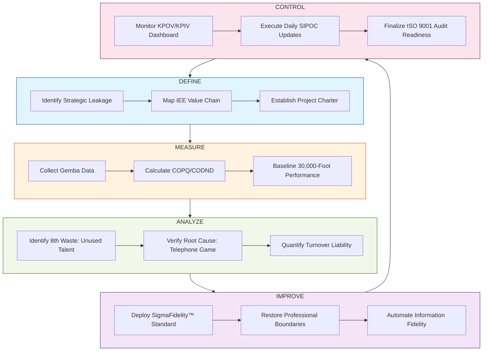

| **Document Control** | |
| :--- | :--- |
| **Document Title** | **S4/IEE Project Execution Roadmap (DMAIC)** |
| **Document ID** | HWB-QMS-STRAT-002 |
| **Version** | 1.0 |
| **Status** | Approved |
| **Author** | LSS Black Belt / Senior Strategy Agent |
| **Date** | 2026-02-21 |

---

# SigmaFidelity™ DMAIC Execution Roadmap

## 1.0 Purpose
This document defines the rigorous S4/IEE execution path for SigmaFidelity™ projects. It ensures that every facility management intervention follows a standardized process to eliminate waste and protect human capital.

## 2.0 DMAIC Execution Chart

## 3.0 Phase Deliverables
*   **Define:** Signed Charter, SIPOC Map, and Stakeholder Analysis.
*   **Measure:** Current State Data, "Waste of Talent" baseline.
*   **Analyze:** Root Cause Matrix (The 5 Whys of the Cargo Cult).
*   **Improve:** Deployed Cleaning Crew, Updated Site SOPs.
*   **Control:** Live Dashboards, Verified Asset Map, Quarterly QMS Reviews.

---

## 4.0 Revision History
| Version | Date | Author | Description |
| :--- | :--- | :--- | :--- |
| 1.0 | 2026-02-21 | Gemini | Initial S4/IEE Roadmap Release. |
