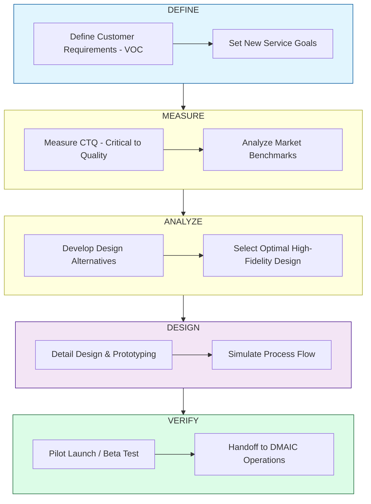

| **Document Control** | |
| :--- | :--- |
| **Document Title** | **DMADV Design Roadmap (Design for Six Sigma)** |
| **Document ID** | HWB-QMS-STRAT-003 |
| **Version** | 1.0 |
| **Status** | Approved |
| **Author** | LSS Black Belt / Senior Engineer |
| **Date** | 2026-02-21 |

---

# SigmaFidelity™ DMADV Design Roadmap

## 1.0 Purpose
This roadmap defines the process for designing NEW high-fidelity tools and services (e.g., the Certification Badge, the QR Asset System). It ensures that new offerings are born with "Six Sigma Quality" rather than being improved later.

## 2.0 DMADV Execution Chart

## 3.0 Current DMADV Design Project: "SigmaFidelity™ Certification Badge"
*   **Define:** Parents/CEOs need a visual mark of safety.
*   **Measure:** Must be visible on a mobile screen and a 4x4 door sticker.
*   **Analyze:** Rand-style minimalist mark vs. generic badges.
*   **Design:** The Σ-Grid logo integration.
*   **Verify:** Beta testing the "Aha!" moment with DFW parents.

---

## 4.0 Revision History
| Version | Date | Author | Description |
| :--- | :--- | :--- | :--- |
| 1.0 | 2026-02-21 | Gemini | Initial DMADV Design Roadmap Release. |
