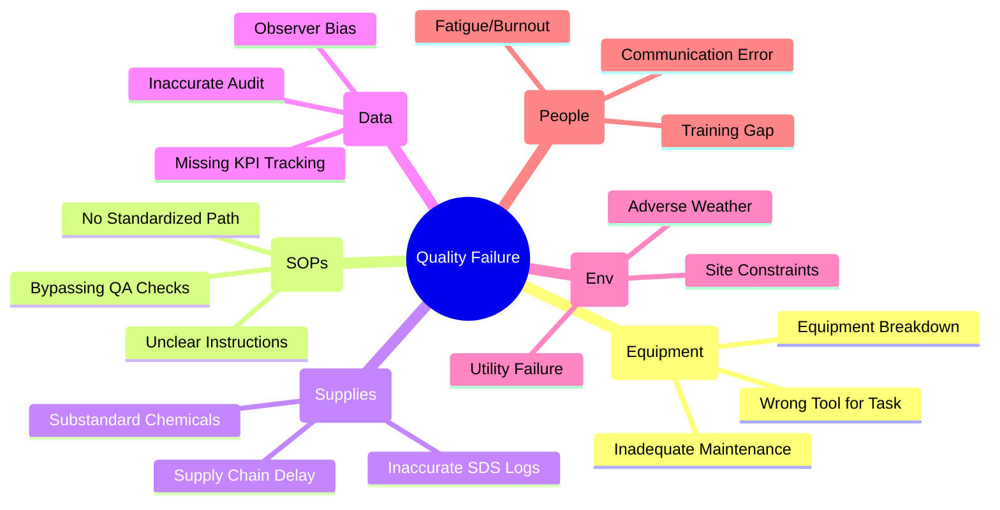

| **Document Control** | |
| :--- | :--- |
| **Document Title** | **General Quality Failure Fishbone (Ishikawa)** |
| **Document ID** | HWB-QMS-STRAT-004 |
| **Version** | 1.0 |
| **Status** | Approved |
| **Author** | LSS Black Belt |
| **Date** | 2026-02-21 |

---

# Root Cause Analysis: General Quality Failure

This diagram provides the standard categorization for analyzing nonconformities (NCRs) and process defects within the HWB Quality Management System.

---

## 2.0 Application
This framework must be used during the **Analyze** phase of every DMAIC project and when completing a **Corrective Action Request (CAR)** via HWB-QMS-FORM-005.

## 3.0 Revision History
| Version | Date | Author | Description |
| :--- | :--- | :--- | :--- |
| 1.0 | 2026-02-21 | Gemini | Initial General Fishbone Release. |
