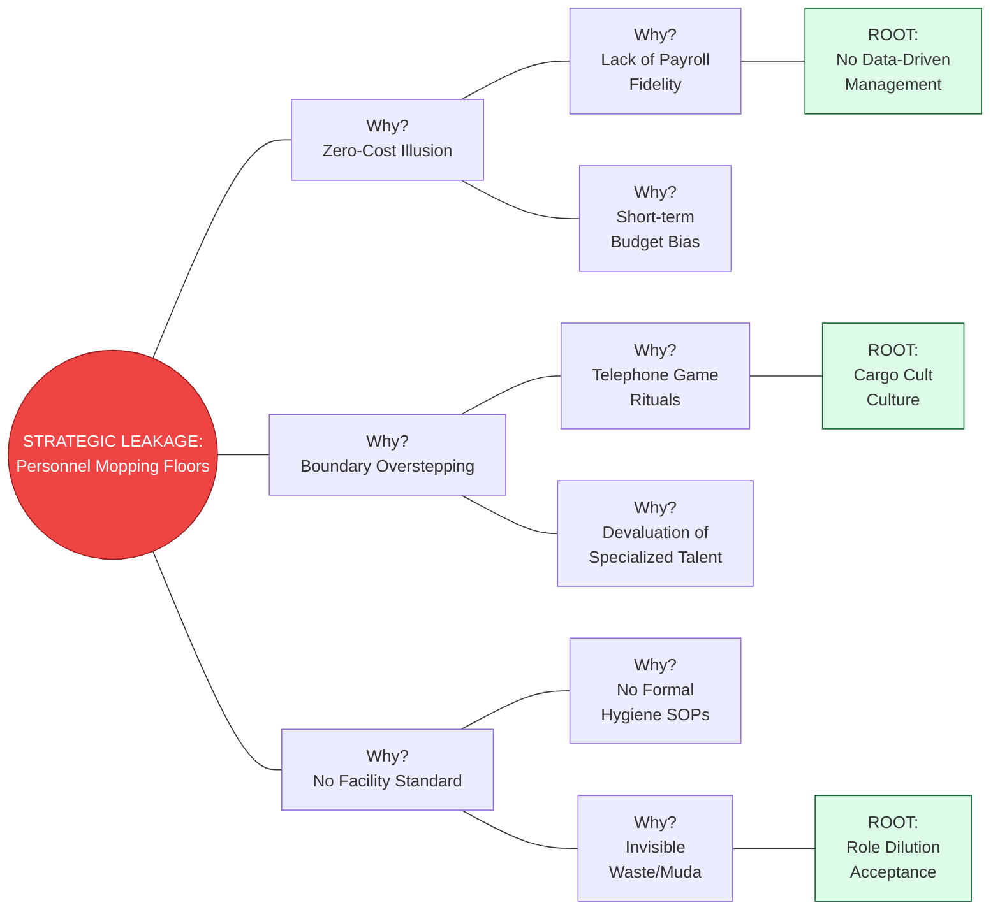

| **Document Control** | |
| :--- | :--- |
| **Document Title** | **Strategic Why-Why Diagram (Root Cause Depth)** |
| **Document ID** | HWB-QMS-STRAT-006 |
| **Version** | 1.0 |
| **Status** | Approved |
| **Author** | LSS Black Belt / Professor Higgins Adaptation |
| **Date** | 2026-02-21 |

---

# Why-Why Analysis: The "Payroll Mop" Crisis

This diagram utilizes the Higgins (1995) method to identify the systemic root causes of human capital misallocation within client organizations.

---

## 2.0 Strategic Insights (Higgins 1995 Model)
*   **The Chain of Causality:** We have identified that "Budget Cutting" (W1_2) is merely a surface-level symptom. The true **Root Cause** is the **Cargo Cult Culture** (R2) where management mimics the *appearance* of efficiency while destroying the *logic* of professional output.
*   **The SigmaFidelity™ Intervention:** Our service doesn't just clean; it targets the **Root Cause (R1)** by providing the **Information Fidelity** required to break the Zero-Cost Illusion.

---

## 3.0 Revision History
| Version | Date | Author | Description |
| :--- | :--- | :--- | :--- |
| 1.0 | 2026-02-21 | Gemini | Initial Release of Higgins-style Why-Why analysis. |
