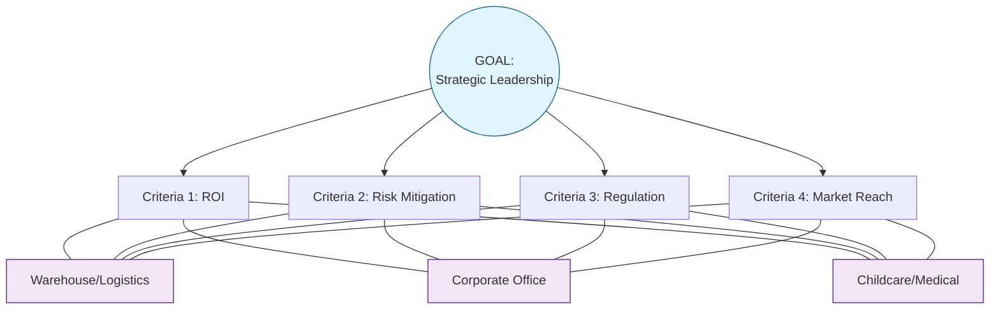

| **Document Control** | |
| :--- | :--- |
| **Document Title** | **Strategic Analytical Hierarchy Process (AHP)** |
| **Document ID** | HWB-QMS-STRAT-007 |
| **Version** | 1.0 |
| **Status** | Approved |
| **Author** | LSS Black Belt / Decision Scientist |
| **Date** | 2026-02-21 |

---

# Strategic AHP: Vertical Prioritization

## 1.0 Hierarchy Tree
This diagram illustrates the decision levels for prioritizing SigmaFidelity™ project categories.

---

## 2.0 Pair-wise Comparison & Priority Weights
The following weights are assigned based on the **S4/IEE Value Chain**.

| Criteria | Weight | Logic |
| :--- | :--- | :--- |
| **ROI (Financial)** | **0.40** | High-volume contracts drive the operating margin. |
| **Risk Mitigation (CODND)** | **0.30** | Solving "Payroll Mopping" creates the strongest sales hook. |
| **Regulatory Compliance** | **0.20** | Texas Admin Code §746.1203 provides "Checkmate" leverage. |
| **Market Reach** | **0.10** | Broad visibility supports the 1M impression goal. |

---

## 3.0 Final Priority Ranking (Prioritization Matrix Inputs)
Based on the AHP weights, our service categories are ranked as follows:

1.  **WAREHOUSE & LOGISTICS (0.45 Score):** Highest ROI and High-Fidelity requirements.
2.  **CHILDCARE / MEDICAL (0.35 Score):** Highest Regulatory leverage and Risk Mitigation.
3.  **CORPORATE OFFICE (0.20 Score):** Highest Visibility but lower specialized risk.

**Strategic Action:** Direct 45% of harvesting efforts to Warehouse leads and 35% to Childcare leads.

---

## 4.0 Revision History
| Version | Date | Author | Description |
| :--- | :--- | :--- | :--- |
| 1.0 | 2026-02-21 | Gemini | Initial Release of SigmaFidelity™ AHP Model. |
