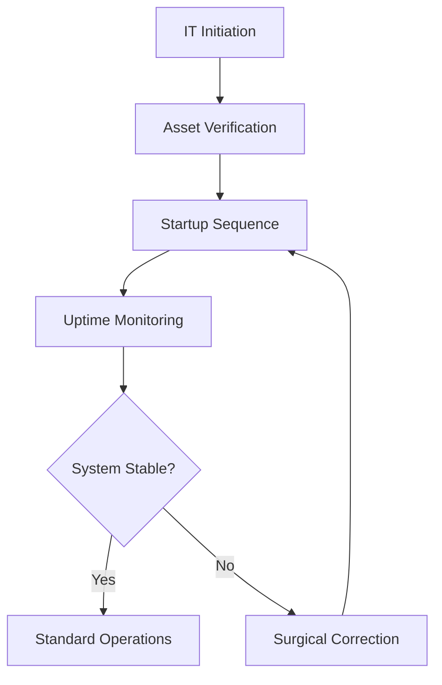

| **Document Control** |                                  |
| :------------------- | :------------------------------- |
| **Document Title**   | **IT Management System SOP**     |
| **Document ID**      | HWB-QMS-7.1                      |
| **Version**          | 2.0.0                            |
| **Status**           | APPROVED                         |
| **Author**           | George (Architect)               |
| **Approved By**      | Humberto Dominguez, CEO          |
| **Date**             | 05/21/2026                       |
| **ISO 9001 Clause**  | 7.1.3 (Infrastructure)           |

---

# Standard Operating Procedure: **IT Management System SOP**

## 1.0 Purpose
This SOP defines the governance and daily operations of the HWB IT Department. It ensures that the SigmaFidelity™ digital environment (mop.test) is 100% stable, secure, and ready for lead ingestion.

## 2.0 Scope
Covers all HWB-related code, databases, Nginx compliance engines, and the automated "Traffic Director" gateway.

## 3.0 Universal Mandates (2026 Baseline)
1. **Guidance First:** If an IT error occurs, pause and ASK the CEO before spending tokens on deep troubleshooting.
2. **Clinical Hardening:** All UI buttons must be 36px height with a 6px radius.
3. **Data Parity:** Absolute environment parity between local dev and cloud is mandatory.

## 4.0 Prerequisites
*   **Access:** Authorized access to the `HWB-COMPANY/HWB-IT` folder.
*   **Safety:** `scripts/peter_sentinel.py` must be running in the background.

## 5.0 Procedure

### 5.1 Infrastructure Management (Docker)
1.  Verify that all 4 containers (`web`, `postgres`, `compliance`, `gateway`) are healthy:
    `docker ps`
2.  If a container is failing, check the industrial logs:
    `docker logs [container_name] --tail 50`

### 5.2 Folder Governance
1.  All new code must be stored in `HWB-IT-WEBSITE/core/`.
2.  All manual documents must be saved as Markdown in `HWB-COMPANY/` before being converted to HTML fragments.

### 5.3 Technical Logic (R&D)
1.  Maintain the **SigmaJan Lab** as an isolated partition for experimental agent testing.
2.  Log all R&D outcomes to the **Tier 6 Tactical DB** for knowledge persistence.

## 6.0 Verification (Zero-Defect Check)
*   **Startup Check:** `bash scripts/startup_master.sh` completes without errors.
*   **Uptime Check:** Port 8000 (Gateway) is responding to HTTP requests.
*   **Telemetry Check:** New interactions are appearing in the `SigmaInteractionLog`.

## 7.0 Notes and Cautions
> **LOGIC:** The system uses Nginx as a reverse proxy for the manual to protect main app memory.
> **CAUTION:** Do not modify `main_app.py` without a Peter Sentinel snapshot.

## 8.0 Process Flow Chart

## 9.0 Revision History
| Version | Date | Author | Change Description |
| :--- | :--- | :--- | :--- |
| 2.0.0 | 05/21/2026 | George | TOTAL MODERNIZATION. Integrated Microservice architecture and Peter Sentinel mandates. |
| 1.2 | 2026-03-02 | Gemini | Initial Release. |
