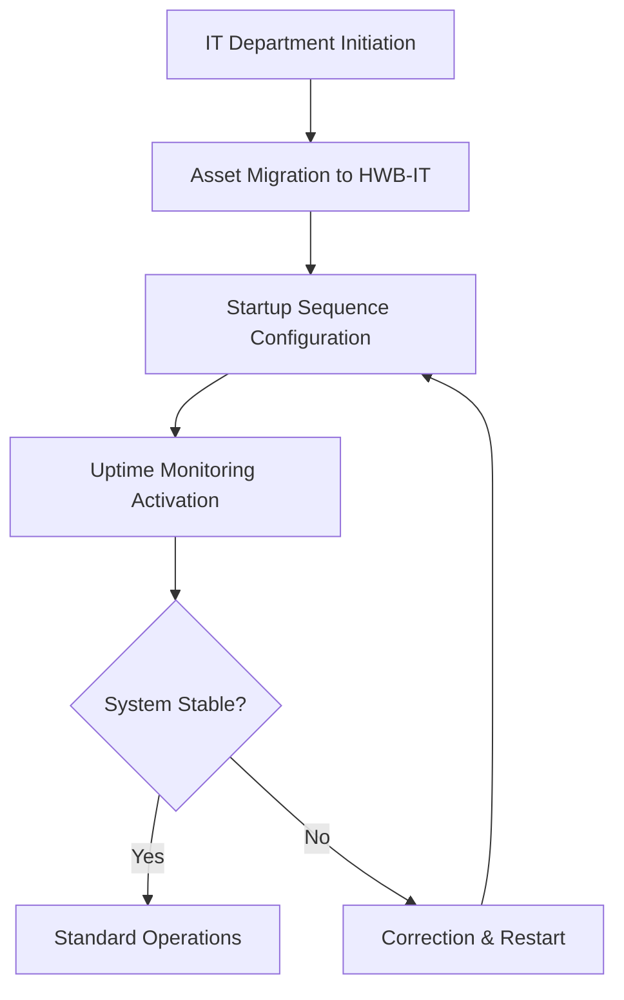

| **Document Control** |                              |
| :------------------- | :--------------------------- |
| **Document Title**   | **IT Management System SOP** |
| **Document ID**      | [HWB-QMS-7.1]                |
| **Version**          | 1.2                          |
| **Status**           | Approved                     |
| **Author**           | Gemini CLI                   |
| **Approved By**      | SigmaFidelity™ Orchestrator  |
| **Date**             | 2026-02-28                   |

---

# Standard Operating Procedure: **IT Management System SOP**

## 1.0 Purpose
The purpose of this SOP is to define the structure and governance of the HWB IT Department. This department manages the SigmaFidelity™ digital infrastructure, webserver availability (mop.test), and technical automation for HWB Cleaning Services LLC under ISO 9001:2015 Clause 7.1.3 (Infrastructure).

## 2.0 Scope
This SOP applies to all HWB-related digital assets, including the `mop.test` webserver, AI agents, automation scripts, and database management systems.

## 3.0 Prerequisites
- Access to the `HWB-COMPANY/HWB-IT` folder.
- Administrative privileges for the webserver environment.
- Knowledge of the SigmaFidelity™ startup sequence and monitoring alerts.

## 4.0 Procedure

### 4.1 Folder and Project Management
1.  All IT-related projects and codebases must be stored in `HWB-COMPANY/HWB-IT/`.
2.  The `mop.test` website is the primary production asset in this department.

### 4.2 Webserver Administration (mop.test)
1.  Maintain the `HWB-WEB App.py` production code.
2.  Monitor and report uptime using the EHSQ/IT integrated monitoring tool.
3.  Ensure security by restricting the server to `127.0.0.1`.

### 4.3 Process Flow Chart

### 4.4 Important Logins
The following links are critical for the administration of the HWB digital infrastructure:

1.  **Google Cloud Console (hwb-cleaning):** [https://console.cloud.google.com/welcome?project=hwb-cleaning](https://console.cloud.google.com/welcome?project=hwb-cleaning)
2.  **Microsoft Azure Portal (SigmaFidelity):** [https://portal.azure.com](https://portal.azure.com)

### 4.5 CRM Application (hwb_crm)
The HWB CRM application is a dedicated lead management tool for tracking and converting prospective clients into HWB service agreements.

1.  **Storage Location:** `HWB-COMPANY/HWB-IT/HWB-CRM/`
2.  **Database Engine:** SQLite (`crm.db`)
3.  **Application Logic:** `app.py`
4.  **Database Initialization:** `init_db.py`

All CRM-related development and data management must occur within this subdirectory to maintain project-wide organizational integrity.

## 5.0 Verification
- Success of the `startup_master.sh` script execution.
- Webserver availability on Port 5000 (Localhost).
- Database integrity checks (Diag Dashboard).

## 6.0 Notes and Cautions
- Do not modify production code without a version-controlled backup.
- All HWB-QMS IT documents must follow the departmental naming convention: **HWB-IT**.

## 7.0 Revision History
| Version | Date       | Author     | Change Description |
| :---    | :---       | :---       | :---               |
| 1.0     | 2026-02-28 | Gemini CLI | Initial Release: Established IT governance and migrated mop.test. |
| 1.1     | 2026-03-02 | Gemini CLI | Added Section 4.4: Important Logins (Google Cloud/Azure). |
| 1.2     | 2026-03-02 | Gemini CLI | Migrated hwb_crm to HWB-COMPANY/HWB-IT/HWB-CRM and updated documentation. |

## 8.0 Document Conventions
- **Document ID:** [HWB-QMS-7.1]
- **Storage Location:** HWB-COMPANY/HWB-IT/
