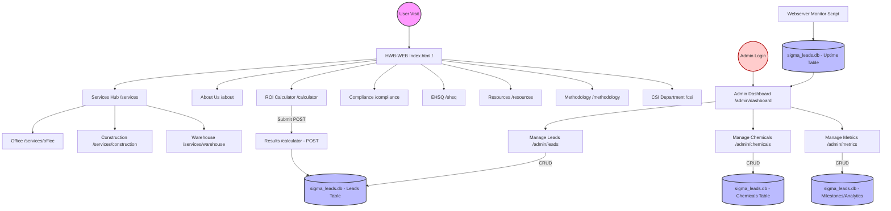

| **Document Control** |                                              |
| :------------------- | :------------------------------------------- |
| **Document Title**   | **Website Architectural Flowchart SOP**      |
| **Document ID**      | HWB-QMS-7.1-WEB-001                          |
| **Version**          | 1.0                                          |
| **Status**           | Approved                                     |
| **Author**           | George (AI Assistant)                        |
| **Approved By**      | Gemini (Senior ISO 9001 Auditor)             |
| **Date**             | 2026-03-02                                   |

---

# Standard Operating Procedure: **Website Architectural Flowchart SOP**

## 1.0 Purpose
This SOP defines the standardized architectural mapping of the HWB Cleaning Services LLC SigmaFidelity™ website. The objective is to ensure structural transparency, data integrity, and a seamless user experience across all public and administrative interfaces.

## 2.0 Scope
This procedure applies to all web development, maintenance, and administrative management tasks within the `HWB-COMPANY/HWB-IT/HWB-WEBSITE/` project directory.

## 3.0 Prerequisites
*   Verified access to the `HWB-WEB App.py` routing logic.
*   Understanding of the `base.html` layout and template inheritance system.
*   Knowledge of the `Leads` and `Analytics` database structures in `sigma_leads.db`.

## 4.0 Procedure

### 4.1 Process Flow Chart: Website Architecture

### 4.2 Architectural Guidelines
1.  **Template Inheritance:** All pages MUST extend `base.html` to ensure visual and navigational consistency.
2.  **Route Definition:** Every route defined in `HWB-WEB App.py` must have a corresponding entry in this flowchart.
3.  **Data Persistence:** All form submissions (ROI Calculator, Admin Updates) must map to the appropriate SQLite table for empirical tracking.

## 5.0 Verification
*   Periodic audit of the `HWB-WEB App.py` routes against this flowchart.
*   Visual confirmation of the `base.html` layout on all active URLs.
*   Database integrity checks (Diagnostics) during system startup.

## 6.0 Notes and Cautions
*   **Security:** Ensure the `/admin/` routes are properly protected in a production environment (Nginx/Auth).
*   **Version Control:** This flowchart must be updated whenever a new service sector or administrative tool is added to the website.

## 7.0 Revision History
| Version | Date | Author | Change Description |
| :--- | :--- | :--- | :--- |
| 1.0 | 2026-03-02 | George | Initial Release: Formalized SigmaFidelity™ website architecture. |

## 8.0 Document Conventions
*   **Ovals (Terminals):** Entry and exit points for user and admin sessions.
*   **Rectangles (Processes):** Specific web pages or routes.
*   **Cylinders (Databases):** SQLite data storage and interaction points.
*   **Arrows (Flow):** Direction of user navigation or data processing.
