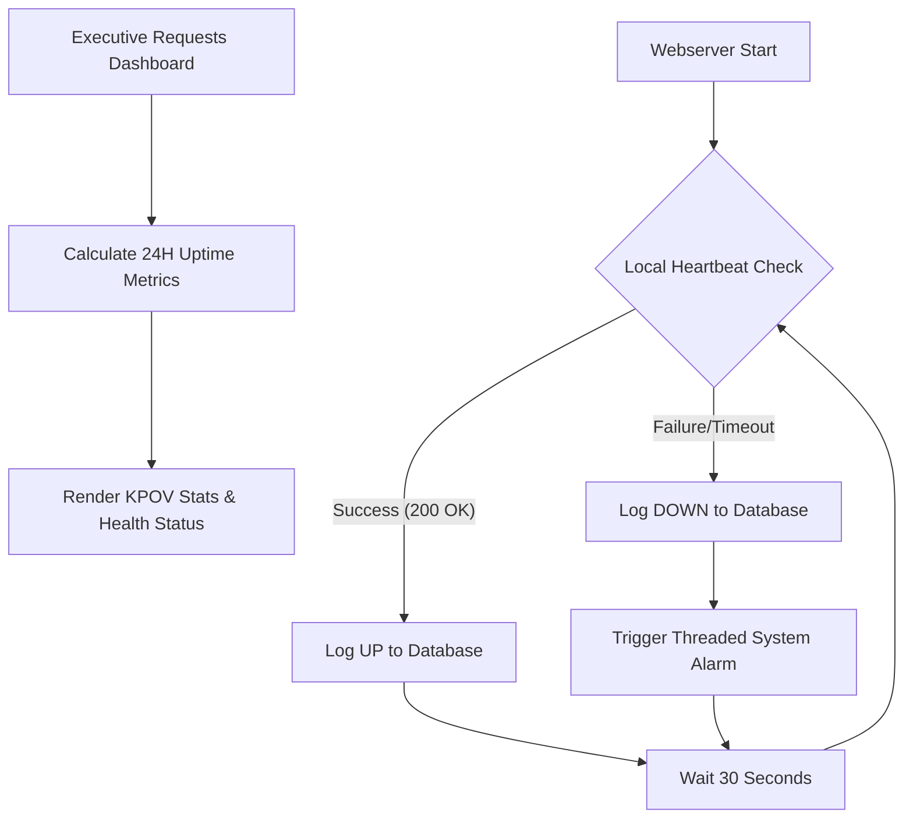

| **Document Control** |                                  |
| :------------------- | :------------------------------- |
| **Document Title**   | **Webserver Monitoring and Uptime Analytics SOP** |
| **Document ID**      | [QMS-9.1-SYS]                   |
| **Version**          | 1.0                              |
| **Status**           | Approved                         |
| **Author**           | Gemini CLI                       |
| **Approved By**      | SigmaFidelity™ Orchestrator      |
| **Date**             | 2026-02-28                       |

---

# Standard Operating Procedure: **Webserver Monitoring and Uptime Analytics SOP**

## 1.0 Purpose

The purpose of this SOP is to define the procedure for maintaining, monitoring, and reporting the availability of the SigmaFidelity™ Webserver (mop.test). This ensures high-fidelity data availability for executive decision-making and aligns with ISO 9001:2015 performance evaluation standards.

## 2.0 Scope

This SOP applies to the `mop_incident` (SigmaFidelity™) project suite, specifically the Flask-based web application, the automated monitoring agent, and the associated SQLite production database.

## 3.0 Prerequisites

*   Linux/WSL environment with Python 3.12.
*   `python3-tk` and `python3-flask` system packages.
*   Access to the `sigma_leads.db` production database.
*   Correctly configured `mop.test` entry in the hosts file.

## 4.0 Procedure

### 4.1 Security & Infrastructure Lockdown

1.  Configure the webserver to listen exclusively on the local loopback address (`127.0.0.1`) to prevent unauthorized external access.
2.  Ensure `debug=False` in production environments to prevent process interruption by the Flask reloader.
3.  Utilize `nohup` and `disown` during the startup sequence to ensure persistent background operation.

### 4.2 Automated Uptime Monitoring

1.  Execute the `HWB-WEB Webserver Monitor.py` agent.
2.  The agent performs a heartbeat check every 30 seconds against the local endpoint.
3.  Each check result (UP: 1, DOWN: 0) is logged to the `Uptime` table in the database.
4.  In the event of a "DOWN" status, the agent triggers a multi-threaded system alarm via the `tkinter` interface.

### 4.3 Executive Dashboard Integration

1.  The `admin_dashboard` route retrieves the last 24 hours of uptime data (2880 records).
2.  Calculate the Uptime Percentage: `(Up Checks / Total Checks) * 100`.
3.  Calculate Total Downtime: `(Total Checks - Up Checks) * 0.5` minutes.
4.  Render the results to the **Executive Performance Dashboard** within the "System Stability & Uptime" section.

### 4.4 Process Flow Chart

## 5.0 Verification

1.  Confirm Port 5000 status: `netstat -tuln | grep :5000`.
2.  Verify database logs: `SELECT COUNT(*) FROM Uptime;`.
3.  Visual check: Navigate to `/admin/dashboard` and verify the "System Stability" card displays a valid percentage.

## 6.0 Notes and Cautions

*   **Caching:** Browsers may cache old versions of templates. Hard refresh (Ctrl+F5) if UI updates are not visible.
*   **Database Lock:** SQLite may experience lock contention if the monitor and webserver attempt simultaneous writes during high traffic. Monitor the `HWB-WEB Server.log` for database errors.

## 7.0 Revision History

| Version | Date       | Author     | Change Description |
| :---    | :---       | :---       | :---               |
| 1.0     | 2026-02-28 | Gemini CLI | Initial Release: Integrated Uptime tracking and dashboard metrics. |

## 8.0 Document Conventions

*   **Title:** Webserver Monitoring and Uptime Analytics SOP.
*   **Document ID:** [QMS-9.1-SYS].
