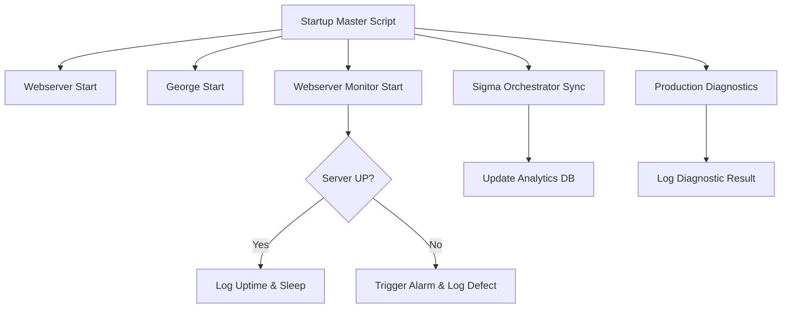

| **Document Control** |                                              |
| :------------------- | :------------------------------------------- |
| **Document Title**   | **AI Agents and Specialised Scripts SOP**    |
| **Document ID**      | HWB-QMS-9.2                                  |
| **Version**          | 1.4                                          |
| **Status**           | Approved                                     |
| **Author**           | Gemini (Senior ISO 9001 Auditor)             |
| **Approved By**      | SigmaFidelity™ Orchestrator                  |
| **Date**             | 2026-03-02                                   |

---

# Standard Operating Procedure: **AI Agents and Specialised Scripts SOP**

## 1.0 Purpose

This SOP defines the roles, responsibilities, and operational logic of the autonomous AI agents and specialised scripts within the SigmaFidelity™ ecosystem. The objective is to ensure system uptime, data integrity, and automated marketing performance in alignment with ISO 9001 quality standards.

## 2.0 Scope

This procedure applies to all automated Python scripts, shell scripts, and AI agents operating within the `gemini_projects` workspace, specifically those managed by the `startup_master.sh` sequence.

## 3.0 Roles and Responsibilities

### 3.1 Gemini CLI (Lead Autonomous Agent)
*   **Role:** Senior Software Engineer, Collaborative Peer Programmer, PhD in Business History, and Senior ISO 9001 Auditor.
*   **Responsibility:** Orchestration of the development lifecycle, reproduction and fixing of bugs, creation of ISO-compliant documentation, and high-level system analysis.

### 3.2 George (AI Marketing Assistant)
*   **Role:** Autonomous Content Manager, Lead Generation Agent, and Web Developer.
*   **Responsibility:** 
    *   Monitors the `HWB-WEB News Queue.json`, rotates news articles in the web resources template, and ensures a fresh marketing presence.
    *   Conducts deep-web searches for construction companies and active developments requiring post-construction cleaning contractors.
    *   Generates lead reports for strategic integration into daily operational notes.
    *   **Website Management:** Responsible for the continuous development, maintenance, and periodic updating of the HWB company website, including HTML/CSS refinements and Flask backend logic updates.

### 3.3 Sigma Orchestrator (`HWB-WEB Sigma Orchestrator.py`)
*   **Role:** Strategic Data Analyst.
*   **Responsibility:** Calculates SigmaFidelity™ metrics (Cpk, DPMO, RTY), synchronizes the production database, and updates strategic daily notes in Obsidian.

### 3.4 Webserver Monitor (`HWB-WEB Webserver Monitor.py`)
*   **Role:** System Uptime Guardian.
*   **Responsibility:** Performs 30-second heartbeat checks on the local webserver, logs uptime data to SQLite, and triggers visual/auditory alarms upon failure detection.

### 3.5 Production Diagnostics (`HWB-WEB Diag Dashboard.py`)
*   **Role:** Quality Control Inspector.
*   **Responsibility:** Verifies database table integrity and analytics consistency during every system startup.

### 3.6 Database Connectivity Agent (MCP Toolbox)
*   **Role:** Universal Database Liaison.
*   **Responsibility:** Provides seamless natural language interfaces to a wide array of database engines, including BigQuery, Cloud SQL (MySQL, PostgreSQL, SQL Server), Spanner, Firestore, and self-hosted Redis, MySQL, and PostgreSQL instances.

## 4.0 Procedure

### 4.1 System Initiation
1.  Execute `bash scripts/startup_master.sh`.
2.  Verify the startup of the Webserver (Port 5000), George (AI Marketing Assistant), and Webserver Monitor.
3.  Confirm successful completion of the Sigma Orchestrator Sync and Production Diagnostics.

### 4.2 Monitoring and Maintenance
1.  **Log Review:** Periodically inspect `HWB-WEB Server.log`, `HWB-WEB News.log`, and `HWB-WEB Monitor.log` for anomalies.
2.  **Alarm Response:** Upon a Monitor Alarm (GUI Alert), immediate manual intervention is required to restart the webserver or diagnose connectivity issues.
3.  **Database Integrity:** Ensure the `Analytics` and `Uptime` tables in `sigma_leads.db` are updated according to script intervals.

### 4.3 [Process Flow Chart]

### 4.4 Database Operations via MCP
1.  **Discovery:** Use the `mcp-toolbox-for-databases` to identify available data structures and schemas.
2.  **Querying:** Execute natural language queries to retrieve empirical data from supported engines.
3.  **Enrichment:** Leverage conversational analytics to derive strategic insights from large datasets (e.g., BigQuery).

## 5.0 Verification

*   Presence of active PIDs in `server.pid`, `news.pid`, and `monitor.pid`.
*   Verification of "STABLE" control status in the `Analytics` table.
*   Successful deployment of news cycles in the `HWB-WEB Resources.html` file.

## 6.0 Notes and Cautions

*   **Security:** Never expose `.venv` credentials or internal database paths to external environments.
*   **Concurrency:** Ensure only one instance of the `startup_master.sh` sequence is running to avoid port conflicts and database locks.

### 6.1 Data Integrity (SigmaFidelity™ Standard)
*   **Zero Synthetic Data Policy:** The generation or use of synthetic, simulated, or "make-belief" data is strictly prohibited across all AI agents and scripts.
*   **Empirical Validation:** All lead reports, analytics, and diagnostic outputs must be derived from verified, real-world empirical data. Any data used for strategic decision-making must be traceable to a primary source or live system metric.

## 7.0 Revision History

| Version | Date | Author | Change Description |
| :--- | :--- | :--- | :--- |
| 1.0 | 2026-02-28 | Gemini | Initial Release: Formalised AI Agent roles and operations. |
| 1.1 | 2026-03-01 | Gemini | Renamed AI Marketing Agent to George. |
| 1.3 | 2026-03-02 | Gemini | Installed mcp-toolbox-for-databases (genai-toolbox) extension for enhanced MCP and database capabilities. |
| 1.4 | 2026-03-02 | Gemini | Installed nanobanana and nano-banana-skills extensions for advanced CLI capabilities. |
| 1.5 | 2026-03-02 | George | Installed strategic extensions: Google Workspace, Vibe Prospecting, BigQuery Analytics, and Advanced SEO for enhanced marketing and reporting. |
| 1.6 | 2026-03-03 | Gemini | Updated mcp-toolbox-for-databases to v0.28.0 and formalized its role and procedures within the SOP. |

