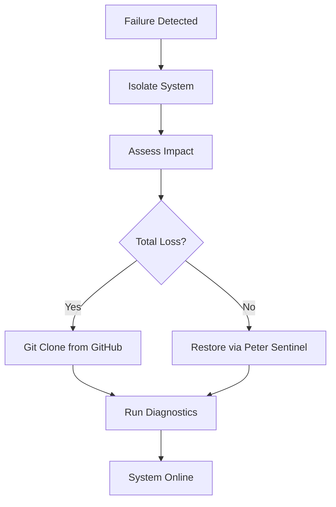

| **Document Control** |                                              |
| :------------------- | :------------------------------------------- |
| **Document Title**   | **Disaster Recovery and Data Restoration SOP** |
| **Document ID**      | HWB-QMS-9.3                                  |
| **Version**          | 2.0.0                                        |
| **Status**           | APPROVED                                     |
| **Author**           | George (Architect)                           |
| **Approved By**      | Humberto Dominguez, CEO                      |
| **Date**             | 05/21/2026                                   |
| **ISO 9001 Clause**  | 7.1.3 (Infrastructure)                       |

---

# Standard Operating Procedure: **Disaster Recovery and Data Restoration SOP**

## 1.0 Purpose
This SOP defines how we recover our company data if a computer fails or a "catastrophe" occurs. It ensures that HWB Cleaning Services LLC can get back to work quickly by restoring our files from GitHub and our local backups.

## 2.0 Scope
Applies to all HWB digital assets, including our manuals, website code, databases, and AI agent "Brains" (/core).

## 3.0 Universal Mandates (2026 Baseline)
1. **Guidance First:** If a file is missing, ASK the CEO for guidance before searching the server.
2. **Tier 6 Telemetry:** Every recovery action must be logged to the `SigmaInteractionLog`.
3. **Physical Truth:** Reference absolute server paths for all restoration points.

## 4.0 Prerequisites
*   **Git:** Must be installed on the recovery machine.
*   **Authorized Access:** Access to the GitHub repository (Humbertoed11/gemini_projects).
*   **Peter Sentinel:** Must be configured to perform snapshots every 15 minutes.

## 5.0 Procedure

### 5.1 Restoring from GitHub (The Cloud Master)
In the event of total computer failure, the GitHub repository is our "Source of Truth."
1.  Navigate to the workspace folder.
2.  Clone the repository using the command: `git clone https://github.com/Humbertoed11/gemini_projects.git`
3.  Run the startup command: `bash scripts/startup_master.sh`

### 5.2 The "Panic Button" (Emergency Reset)
If the system is acting strangely or is broken, use the forceful reset:
`git reset --hard HEAD && git clean -fd`
> **CAUTION:** This will delete all work that hasn't been saved to Git.

### 5.3 Physical Restoration (Peter Sentinel)
If a specific file or folder (like the agents/ folder) is deleted:
1.  Navigate to `HWB-COMPANY/HWB-IT/HWB-IT-SYSTEM-LOGS/shadow_snapshots/`.
2.  Locate the folder with the latest timestamp.
3.  Copy the missing files back into the active production directory.

## 6.0 Verification (Zero-Defect Check)
*   System is online and responding at `http://mop.test:5000`.
*   All 900+ SOPs are visible in the manual index.
*   Databases are healthy and showing real lead data.

## 7.0 Notes and Cautions
> **LOGIC:** The OneDrive mount at `/mnt/c/...` is our physical backup point.
> **CAUTION:** Never delete the `.env` file; it contains our system secrets.

## 8.0 Process Flow Chart

## 9.0 Revision History
| Version | Date | Author | Change Description |
| :--- | :--- | :--- | :--- |
| 2.0.0 | 05/21/2026 | George | TOTAL MODERNIZATION. Added Peter Sentinel physical restoration and Tier 6 mandates. |
| 1.0 | 2026-03-02 | Gemini | Initial Release. |
