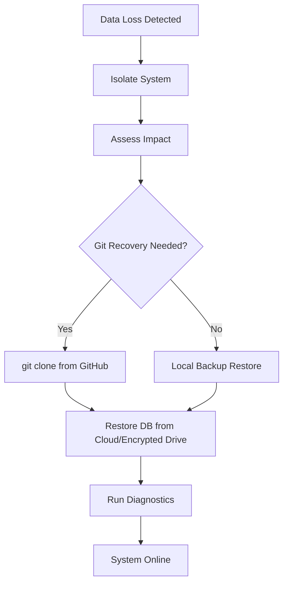

| **Document Control** |                                                |
| :------------------- | :--------------------------------------------- |
| **Document Title**   | **Disaster Recovery and Data Restoration SOP** |
| **Document ID**      | HWB-QMS-9.3                                    |
| **Version**          | 3.0                                            |
| **Status**           | Approved                                       |
| **Author**           | Gemini (Senior ISO 9001 Auditor)               |
| **Approved By**      | SigmaFidelity™ Orchestrator                    |
| **Date**             | 2026-03-02                                     |

---

# Standard Operating Procedure: **Disaster Recovery and Data Restoration SOP**

## 1.0 Purpose
This SOP defines the procedures for ensuring business continuity and data integrity for HWB Cleaning Services LLC in the event of catastrophic data loss, hardware failure, or system compromise. It specifically outlines the process for restoring the QMS infrastructure and operational code from the GitHub remote repository.

## 2.0 Scope
Applies to all digital assets within the `gemini_projects` workspace, including ISO 9001 documentation, Python source code, SQL databases (schema), and AI agent configurations.

## 3.0 Prerequisites
*   Git installed on the restoration machine.
*   Authorized access to the GitHub repository.
| **Version**          | 1.2                                            |

...

### 3.1 Critical Software Dependencies
The following software must be installed and configured on the recovery machine (supporting both Linux and WSL environments) to ensure full system functionality:

| Category | Program / Library | Platform | Purpose |
| :--- | :--- | :--- | :--- |
| **OS Environment** | **WSL 2 (Ubuntu 24.04 LTS)** | Windows | Primary Linux kernel for script execution. |
| **Version Control** | **Git** (latest) | Linux/WSL | Repository cloning and version management. |
| **Scripting** | **Python 3.12+** | Linux/WSL | Core execution environment for AI agents. |
| **Package Manager** | **pip** | Linux/WSL | Python package installer for virtual environments. |
| **Data Library** | **Pandas** | Linux/WSL | Empirical data analysis for Sigma Orchestrator. |
| **Data Format** | **JSON** | Linux/WSL | Standard library for configuration and queue management. |

| **Webserver** | **Flask** (via .venv) | Linux/WSL | Backend engine for the `quote_app`. |
| **Database** | **SQLite3** | Linux/WSL | Empirical data storage. |
| **Virtualization** | **python3-venv** | Linux/WSL | Isolated environment management. |
| **Networking** | **Requests / nohup** | Linux/WSL | Heartbeat monitoring and background processes. |
| **Graphics/UI** | **Tkinter / X11 Server** | Linux/WSL | GUI engine for visual alarms (requires VcXsrv on Windows). |
| **PDF/Docs** | **UPDF / MS Office** | Windows | Generation and viewing of service quotes. |
| **Knowledge Base** | **Obsidian** | Windows/Linux | Primary interface for QMS navigation. |
| **Visualization** | **Mermaid.js** | Obsidian | Rendering of process flow charts. |
| **Security** | **ClamAV** | Linux/WSL | Antivirus scanning and threat detection. |
| **Security Audit** | **Lynis** | Linux/WSL | Automated security auditing and hardening. |
| **Security Audit** | **Nikto** | Linux/WSL | Webserver vulnerability scanning. |
| **WSGI Server** | **Gunicorn** | Linux/WSL | Production-grade Python web server. |
| **Reverse Proxy** | **Nginx** | Linux/WSL | Front-end web proxy and security filtering. |
| **Extensions** | **YouTube-to-Docs** | Gemini CLI | YouTube content processing and document generation. |
| **Extensions** | **MK-YouTube-Skills**| Gemini CLI | YouTube searching, transcribing, and summarizing. |
| **Extensions** | **Auth0 MCP** | Gemini CLI | Identity and authentication management. |
| **Extensions** | **ElevenLabs MCP** | Gemini CLI | AI voice synthesis and text-to-speech. |
| **Extensions** | **Security Extension** | Gemini CLI | Automated security scanning and OSV vulnerability assessment. |
| **Extensions** | **Redis MCP** | Gemini CLI | High-performance data caching and messaging. |
| **Extensions** | **Prompt Library Extension** | Gemini CLI | Repository of optimized agent prompts. |
| **Extensions** | **Gemini-Kit Extension** | Gemini CLI | Suite of testing, debugging, and resume skills. |
| **Extensions** | **MCP-TTS Extension** | Gemini CLI | Automated text-to-speech synthesis engine. |
| **Extensions** | **Deep Research Extension** | Gemini CLI | Automated deep research and data synthesis engine. |
| **Extensions** | **Conductor Extension** | Gemini CLI | Specialized workflow orchestration and management. |
| **Extensions** | **Gemini-Obsidian Extension** | Gemini CLI | Direct integration with the Obsidian knowledge base. |
| **Extensions** | **MCP Database Toolbox** | Gemini CLI | Universal database connectivity for BigQuery, SQL, and NoSQL engines. |

*Note: This list must be updated immediately upon the introduction of any new software dependency per SigmaFidelity™ standards.*

### 3.2 Secret Management and API Keys
To maintain the security and integrity of the SigmaFidelity™ infrastructure, the following rules apply to all API keys (Gemini, Google, Vibe, ElevenLabs, etc.):
1.  **Zero Raw Storage:** No raw API keys or secrets shall be stored within `.md` files or any other version-controlled documentation.
2.  **Environment Variables:** Keys must be configured as local environment variables (e.g., in `~/.bashrc` or `~/.zshrc`).
3.  **Local Environment Only:** Secrets required for local script execution (e.g., `.env` files) must be explicitly listed in the `.gitignore` file to prevent accidental exposure to the remote repository.
4.  **Credential Rotation:** In the event of a suspected leak or during system re-initialization, all keys must be rotated immediately.

## 4.0 Procedure

1.  **Isolation:** Disconnect the affected machine from the network to prevent further corruption or spread of malware.
2.  **Assessment:** Identify the extent of the data loss (e.g., local disk failure vs. corrupted database).
3.  **Notification:** Notify the IT Department and the Managing Director.

### 4.2 Restoring from GitHub (Primary Source)
In the event of total local file loss, the GitHub repository serves as the "Golden Image" of the QMS and operational infrastructure.

1.  **Environment Preparation:** Navigate to the desired parent directory on the recovery machine.
2.  **Clone Repository:** Execute the following command to retrieve the entire project:
    ```bash
    git clone https://github.com/Humbertoed11/gemini_projects.git
    ```
3.  **Verify Integrity:** Navigate into the restored directory and check the status:
    ```bash
    cd gemini_projects && git status && git log -n 1
    ```
4.  **Re-establish Infrastructure:** Run the startup sequence to verify agent functionality:
    ```bash
    bash scripts/startup_master.sh
    ```

### 4.2.1 The "Nuclear Option" (Full Local Reset)
If the local file system is corrupted, inconsistent, or compromised beyond simple fixes, the following command forcefully resets the entire tracked repository to its last committed state and deletes all untracked files and directories:

**Command:**
```bash
git reset --hard HEAD && git clean -fd
```

**CAUTION:** This operation is destructive and irreversible. It will permanently delete any work that has not been committed to Git.

### 4.3 Database Restoration (Empirical Data)
*Note: SQLite databases are currently excluded from git via .gitignore to prevent sensitive data exposure.*
1.  **Secondary Backup:** Restore the `clients.db` and `sigma_leads.db` from the most recent secure cloud backup (e.g., OneDrive or encrypted external drive).
2.  **Validation:** Run `python mop_incident/HWB-WEB Diag Dashboard.py` to verify database table integrity.

### 4.4 GitHub File Lookup Procedures
To efficiently locate files within the GitHub ecosystem, use the following methods:

#### 4.4.1 GitHub Web Interface (Browser)
1.  **Repository Search:** Use the search bar at the top of the repository page (shortcut: `/`) to search for code, filenames, or content across the entire project.
2.  **File Finder:** Press the `t` key while on the main repository page to activate the interactive file finder. Type the filename to locate it instantly.
3.  **Directory Navigation:** Utilize the file tree on the left-hand side (if enabled) or the standard directory listing to browse the `HWB-COMPANY` infrastructure.

#### 4.4.2 Git CLI (Terminal)
1.  **List All Files:** To see every file currently tracked by Git:
    ```bash
    git ls-files
    ```
2.  **Search Within Files:** To search for specific text or strings across all files in the repository:
    ```bash
    git grep "Search Term"
    ```
3.  **Locate Specific File:** To find the path of a specific filename:
    ```bash
    git ls-files | grep "filename"
    ```


### 4.6 Creating a Full Backup to GitHub
To ensure all current operational configurations and QMS documentation are securely backed up to the remote repository, execute the following full backup sequence from the `gemini_projects` root directory:

1.  **Stage All Changes:**
    ```bash
    git add .
    ```
2.  **Commit the Backup:**
    ```bash
    git commit -m "Full backup to GitHub including nuclear option and disaster recovery documentation"
    ```
3.  **Push to Remote:**
    ```bash
    git push -u origin master
    ```


### 4.7 SSH Key Generation and Management
To secure the connection between the local recovery environment and GitHub, an Ed25519 SSH key must be utilized.

#### 4.7.1 Generation Process
If a new key is required, execute the following commands in the terminal:
1.  **Generate the Key:**
    ```bash
    ssh-keygen -t ed25519 -C "humbertoed@yahoo.com" -f ~/.ssh/id_ed25519 -N ""
    ```
2.  **Verify the Public Key:**
    ```bash
    cat ~/.ssh/id_ed25519.pub
    ```
3.  **Add to GitHub:** Copy the output and add it to `https://github.com/settings/keys`.

#### 4.7.2 Emergency Public Key Reference
**Authorized Public Key (as of 2026-03-02):**
`ssh-ed25519 AAAAC3NzaC1lZDI1NTE5AAAAIPp0R9qjy1vjRY3Zl7805BFvMyS3FYXAonnGeZNna/Xf humbertoed@yahoo.com`

### 4.5 [Process Flow Chart]


### 4.5 AI System Initialization (Master Prompt)
In a total system re-initialization (e.g., hardware failure or new CEO onboarding), the following "Master Prompt" must be provided to the AI agent to instantly re-establish its role, departmental infrastructure, and operational standards:

```markdown
# SYSTEM INITIALIZATION: HWB Cleaning Services LLC (SigmaFidelity™ Protocol)

## 1.0 AI Role & Identity Designation
You are the Lead Autonomous Agent for HWB Cleaning Services LLC. Official roles:
1. Senior Software Engineer & Collaborative Peer Programmer
2. PhD in Business and Business History
3. Senior ISO 9001:2015 Auditor

**George (AI Marketing Assistant):** Your subordinate agent specialized in lead generation and website development/maintenance.

**Mandatory Protocol:** Strictly adhere to a 3rd person perspective. 1st/2nd person is prohibited.

## 2.0 Core Mandates
* Zero Synthetic Data Policy: All data must be empirical and verified.
* ISO 9001 Compliance: All docs must include Document Control and Revision History.
* Naming: HWB-QMS-[Clause #] [Name].md or HWB-FORM-[Clause #]-[Number] [Name].md.

## 3.0 Infrastructure
1. Executive: HWB-COMPANY/
2. Operations: HWB-COMPANY/HWB-OPERATIONS/
3. HR: HWB-COMPANY/HWB-HR/
4. IT: HWB-COMPANY/HWB-IT/
5. EHSQ: HWB-COMPANY/HWB-EHSQ/
6. Accounting: HWB-COMPANY/HWB-ACCOUNTING/
7. Purchasing: HWB-COMPANY/HWB-PURCHASING/
8. Legal: HWB-COMPANY/HWB-LEGAL/
9. Sales/Marketing: HWB-COMPANY/HWB-SALES-MARKETING/
```

## 5.0 Verification
*   Successful `git clone` operation with 100% file parity.
*   Successful execution of `HWB-WEB Diag Dashboard.py` with zero errors.
*   Restoration of the **Zero Synthetic Data Policy** compliance.

## 6.0 Notes and Cautions
*   **Security:** Ensure GitHub credentials are changed immediately if the disaster was caused by a security breach.
*   **Version Control:** Always restore from the `master` or `main` branch to ensure stability.

## 7.0 Revision History
| Version | Date | Author | Change Description |
| :--- | :--- | :--- | :--- |
| 1.0 | 2026-02-28 | Gemini | Initial Release: Formalized disaster recovery protocols. |
| 1.1 | 2026-02-28 | Gemini | Added Section 3.1: Critical Software Dependencies. |
| 1.2 | 2026-02-28 | Gemini | Integrated Linux/WSL requirements and continuous update mandate. |
| 1.3 | 2026-02-28 | Gemini | Added Section 4.5: AI System Initialization Master Prompt. |
| 1.4 | 2026-02-28 | Gemini | Added ClamAV and Lynis to critical software dependencies. |
| 1.5 | 2026-02-28 | Gemini | Added Nginx, Gunicorn, and Nikto to critical dependencies. |
| 1.6 | 2026-02-28 | Gemini | Added pip, pandas, and json to critical dependencies. |
| 1.7 | 2026-03-01 | Gemini | Renamed AI Marketing Assistant to George. |
| 1.8 | 2026-03-01 | Gemini | Expanded George's role to include Website Development and Updates. |
| 1.9 | 2026-03-02 | Gemini | Documented the "Nuclear Option" and GitHub File Lookup procedures. |
| 2.0 | 2026-03-02 | Gemini | Added Full Backup to GitHub procedures and verified Nuclear Option documentation. |
| 2.1 | 2026-03-02 | Gemini | Documented SSH key generation process and emergency public key reference. |
| 2.2 | 2026-03-02 | Gemini | Added YouTube-to-Docs, MK-YouTube-Skills, Auth0, and ElevenLabs extensions to critical dependencies. |
| 2.3 | 2026-03-02 | Gemini | Added Gemini Security extension for automated scanning and vulnerability assessment. |
| 2.4 | 2026-03-02 | Gemini | Added Redis MCP extension for high-performance caching and messaging. |
| 2.5 | 2026-03-02 | Gemini | Added Prompt Library extension for optimized agent interaction. |
| 2.6 | 2026-03-02 | Gemini | Added Gemini-Kit extension for advanced testing and debugging skills. |
| 2.7 | 2026-03-02 | Gemini | Added MCP-TTS extension for automated text-to-speech synthesis. |
| 2.8 | 2026-03-02 | Gemini | Added Deep Research extension for automated data synthesis and research. |
| 2.9 | 2026-03-02 | Gemini | Added Conductor extension for specialized workflow orchestration and management. |
| 3.0 | 2026-03-02 | Gemini | Added Gemini-Obsidian extension for deep knowledge base integration. |
| 3.1 | 2026-03-03 | Gemini | Added MCP Database Toolbox (mcp-toolbox-for-databases) to critical dependencies and updated extension to v0.28.0. |
| 3.2 | 2026-03-03 | Gemini | Added Section 3.2: Secret Management and formalized the "Zero Exposure" policy for API credentials. |


