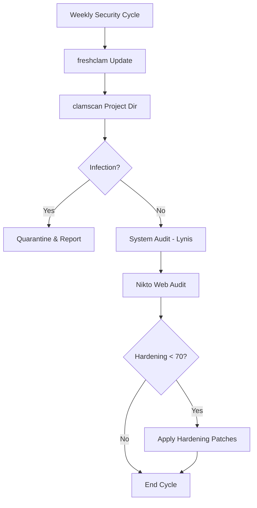

| how**Document Control** |                                  |
| :---------------------- | :------------------------------- |
| **Document Title**      | **Computer Security SOP**        |
| **Document ID**         | HWB-QMS-9.4                      |
| **Version**             | 1.3                              |
| **Status**              | Approved                         |
| **Author**              | Gemini (Senior ISO 9001 Auditor) |
| **Approved By**         | SigmaFidelity™ Orchestrator      |
| **Date**                | 2026-02-28                       |

---

# Standard Operating Procedure: **Computer Security SOP**

## 1.0 Purpose
This SOP defines the technical and administrative controls required to secure the HWB Cleaning Services LLC computing environment. It ensures compliance with ISO 9001:2015 Clause 7.1.3 (Infrastructure) and 8.1 (Operational Planning and Control) by protecting the integrity, availability, and confidentiality of company data.

## 2.0 Scope
Applies to all workstations, servers, and WSL 2 environments utilized for company operations, including the management of the `quote_app` and QMS documentation.

## 3.0 Prerequisites
*   Sudo/Administrative access to Linux/WSL.
*   Installed security tools: ClamAV and Lynis.

## 4.0 Procedure

### 4.1 Antivirus Management (ClamAV)
1.  **Database Updates:** The virus definition database must be updated daily.
    ```bash
    sudo freshclam
    ```
2.  **Full System Scan:** A full scan of the `gemini_projects` directory must be performed weekly.
    ```bash
    clamscan -r /mnt/c/Users/humbe/OneDrive\ -\ hwbcleaning.com/gemini_projects
    ```
3.  **Infection Response:** If a threat is detected, the file must be moved to quarantine and the IT Department notified immediately.

### 4.2 Security Auditing (Lynis)
1.  **Periodic Audit:** A full system security audit must be performed monthly to identify vulnerabilities.
    ```bash
    sudo lynis audit system
    ```
2.  **Hardening:** Management shall review the "Hardening Index" and implement suggested improvements to reach a minimum score of 70.

### 4.3 General System Hardening
1.  **Access Control:** Use of unique, complex passwords for all system accounts.
2.  **Patch Management:** Execute weekly system updates to ensure all security patches are applied.
    ```bash
    sudo apt-get update && sudo apt-get upgrade -y
    ```
3.  **SSH Security:** (If applicable) Disable root login and use SSH keys for remote access.

### 4.4 Webserver Production Security (Iron-Clad)
The HWB digital infrastructure must utilize a production-grade stack to mitigate web vulnerabilities (e.g., clickjacking, DoS).

1.  **Production WSGI (Gunicorn):** All Flask applications must be served via **Gunicorn** instead of the built-in development server.
2.  **Reverse Proxy (Nginx):** Nginx shall be configured to enforce security headers (`X-Frame-Options`, `X-Content-Type-Options`) and handle SSL termination.
3.  **Vulnerability Scanning (Nikto):** A full security audit of web endpoints must be performed monthly.
    ```bash
    nikto -h http://127.0.0.1:5000
    ```

### 4.5 Security Hardening (Lynis Remediation)
Based on monthly Lynis audits, the following system hardening measures must be maintained:

1.  **Kernel Hardening:** Stricter kernel parameters (`sysctl`) must be applied to mitigate network redirects and source routing.
    *   *Configuration:* `/etc/sysctl.d/99-hwb-hardening.conf`.
2.  **Hardening Index Target:** The system must maintain a minimum **Lynis Hardening Index of 70**.
    *   *Action:* Remediate all "Suggestions" with a severity rating of "High" within 7 days of audit.
3.  **Compiler Restriction:** Access to C/C++ compilers (`gcc`, `g++`) must be restricted to the root user or authorized developers only.

### 4.6 [Process Flow Chart]


### 4.7 Secret Management & API Security (Zero-Leak Policy)
To facilitate actual connections to external world databases (MCP Servers), the following secret management protocols are mandatory:

1.  **Environment Isolation:** All API keys and credentials must be stored in a `.env` file. This file MUST be listed in `.gitignore` and never committed to source control.
2.  **Credential Rotation:** API keys for Google Maps and Texas Comptroller services must be rotated every 90 days.
3.  **Restricted Scoping:** API keys must be restricted to the specific IP address of the HWB server and scoped only to the necessary services (e.g., Places API, Geocoding).
4.  **Logging Audit:** George shall log the *timestamp* and *service name* of all API calls to the `Analytics` table, but must NEVER log the actual request payload or response data if it contains PII (Personally Identifiable Information).

## 5.0 Verification
*   ClamAV scan logs verified by the IT Manager.
*   Lynis audit reports archived in `HWB-COMPANY/HWB-IT/Security-Reports/`.
*   Zero unauthorized access incidents.

## 6.0 Notes and Cautions
*   **Zero Synthetic Data:** All security reports must represent the actual state of the local machine.
*   **Performance:** Run full scans during low-activity periods to minimize operational impact.

## 7.0 Revision History
| Version | Date | Author | Change Description |
| :--- | :--- | :--- | :--- |
| 1.0 | 2026-02-28 | Gemini | Initial Release: Established standardized security protocols. |
| 1.1 | 2026-02-28 | Gemini | Added Section 4.4: Webserver Production Security (Gunicorn/Nginx/Nikto). |
| 1.2 | 2026-02-28 | Gemini | Added Section 4.5: Security Hardening (Lynis Remediation). |
| 1.3 | 2026-03-01 | Gemini | Added Section 4.7: Secret Management & API Security. |


