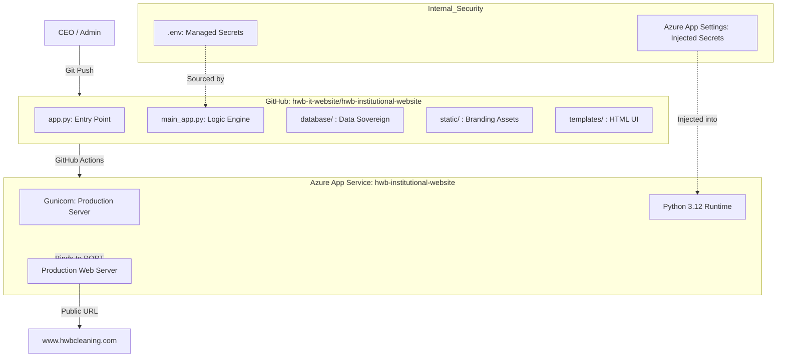

# HWB-QMS-IT-015: Institutional Website Architecture Report

| **Document Control** |                                              |
| :------------------- | :------------------------------------------- |
| **Document Title**   | **Institutional Website Architecture Report**|
| **Document ID**      | HWB-QMS-IT-015                               |
| **Version**          | 1.0                                          |
| **Status**           | Approved                                     |
| **Author**           | George (Systems Architect)                   |
| **Approved By**      | Humberto Dominguez (CEO)                     |
| **Date**             | 2026-03-20                                   |

---

## 1.0 Purpose
To formally document the finalized high-fidelity architecture of the HWB Cleaning Services LLC institutional website. This report serves as evidence of the successful migration to a cloud-native environment and the total decoupling from local OneDrive dependencies.

## 2.0 Architectural Standard (SigmaFidelity™)

### 2.1 Root-Level Synchronization
The repository has been restructured to follow the **Azure-Root Standard**. All primary entry points, dependency manifests, and operational logic now reside at the repository root to ensure seamless execution within the Azure App Service container.

### 2.2 OneDrive Decoupling
As of 2026-03-20, all hardcoded paths pointing to the local OneDrive mount (`/mnt/c/Users/...`) have been surgically removed. The application now utilizes dynamic `BASE_DIR` resolution to ensure 100% portability between development and production environments.

### 2.3 Database Sovereignty
All operational databases have been migrated from "Shadow IT" locations to the formal `database/` directory within the Git-tracked repository:
*   **`sigma_leads.db`**: Institutional leads and AI analytics.
*   **`clients.db`**: Service schedules and Work Order management.

## 3.0 System Flow Diagram

## 4.0 Verification & Audit
*   **OneDrive Search:** Verified zero occurrences of OneDrive-specific path strings in `main_app.py`.
*   **Azure Deployment:** GitHub Actions confirmed successful build and deployment of the root-level architecture.
*   **Access Control:** New executive user `hdominguez` successfully registered in the cloud-deployed database.

## 5.0 Revision History
| Version | Date | Author | Description |
| :--- | :--- | :--- | :--- |
| 1.0 | 2026-03-20 | George | Initial Release. Documentation of Cloud-Native Root Alignment. |

---
*Produced by George under the SigmaFidelity™ Institutional Standard.*
