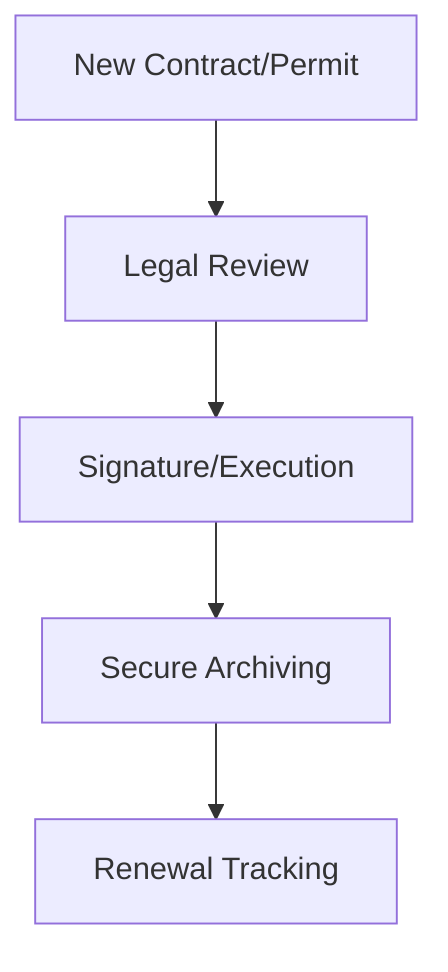

| **Document Control** |                                  |
| :------------------- | :------------------------------- |
| **Document Title**   | **Legal and Compliance SOP**     |
| **Document ID**      | HWB-LEG-001                      |
| **Version**          | 1.0                              |
| **Status**           | Approved                         |
| **Author**           | Gemini (Senior ISO 9001 Auditor) |
| **Approved By**      | SigmaFidelity™ Orchestrator      |
| **Date**             | 2026-02-28                       |

---

# Standard Operating Procedure: **Legal and Compliance SOP**

## 1.0 Purpose
To ensure HWB Cleaning Services LLC operates within all local, state, and federal legal frameworks, including contract management and regulatory compliance.

## 2.0 Scope
Includes contract review, insurance management, and adherence to labor/environmental laws.

## 3.0 Prerequisites
*   Current business licenses and insurance certificates.
*   Legal counsel contact information.

## 4.0 Procedure
1.  **Contract Review:** All client service agreements must be reviewed for indemnity and liability clauses.
2.  **Regulatory Monitoring:** Quarterly review of changes in OSHA, FLSA, and environmental regulations.
3.  **Record Retention:** Secure storage of all legal contracts and permits.

### 4.1 [Process Flow Chart]

## 5.0 Verification
*   Annual compliance audit.
*   Current Status of all business permits and insurance.

## 6.0 Notes and Cautions
*   **Confidentiality:** All legal documents are restricted access.

## 7.0 Revision History
| Version | Date | Author | Change Description |
| :--- | :--- | :--- | :--- |
| 1.0 | 2026-02-28 | Gemini | Initial Release. |
