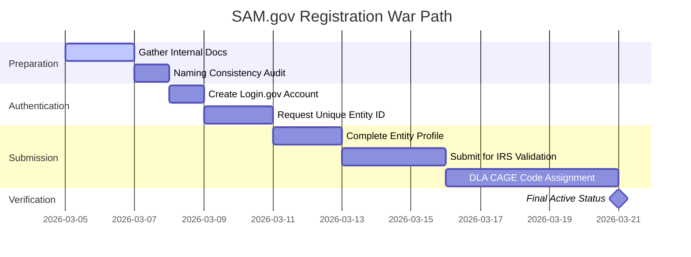

| **Document Control** |                                         |
| :------------------- | :-------------------------------------- |
| **Document Title**   | **SAM.gov Entity Registration Warpath** |
| **Document ID**      | HWB-PLAN-2026-03-05-SAM-REG             |
| **Version**          | 1.0                                     |
| **Status**           | Active / Execution Phase                |
| **Author**           | Silas Sync (VP Systems)                 |
| **Approved By**      | Humberto Dominguez, CEO                 |
| **Date**             | 2026-03-05                              |

---

# 1.0 Purpose
To define the critical path for registering HWB Cleaning Services LLC in the System for Award Management (SAM.gov), enabling the company to bid on federal janitorial and facilities support contracts.

# 2.0 Document Acquisition Checklist
Required items for the `HWB-COMPANY/HWB-LEGAL/SAM-REG/` landing zone:
1.  **IRS EIN Letter:** Form CP-575 or 147C.
2.  **Secretary of State Docs:** Texas Certificate of Formation.
3.  **EFT Details:** Corporate Bank Account & Routing Numbers.
4.  **NAICS Codes:** 561720 (Primary), 561210 (Secondary).
5.  **Revenue Metrics:** 2025 Gross Receipts.
6.  **Historical Identifiers:** DUNS Number: 08-283-0635.

# 3.0 Timeline & Milestones (14 Business Days)

# 4.0 Action Protocol (Zero-Fog Execution)
1.  **Audit:** Silas Sync verifies that the legal name on IRS docs matches the bank and SAM profile exactly (Zero-Defect).
2.  **Generate:** Submit the "Get Unique Entity ID" request once identity is verified.
3.  **Integrate:** Update the Executive Pulse dashboard once the **CAGE Code** is assigned.

---

## 5.0 Revision History
| Version | Date | Author | Description |
| :--- | :--- | :--- | :--- |
| 1.0 | 2026-03-05 | Silas Sync | Initial Warpath established for federal bidding readiness. |

---\n*Institutional Plan produced under the SigmaFidelity™ Quality Mandate.*
