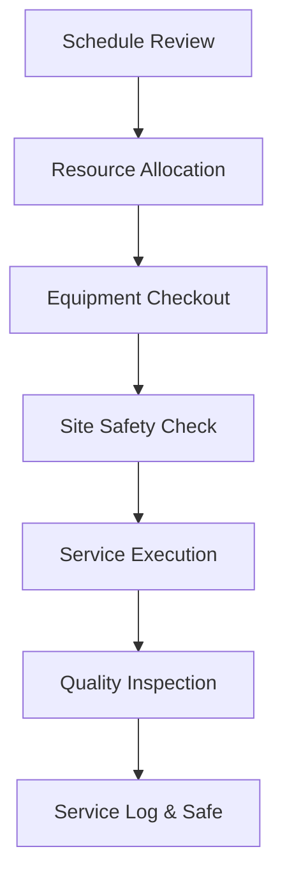

| **Document Control** |                                  |
| :------------------- | :------------------------------- |
| **Document Title**   | **Operations Management SOP**    |
| **Document ID**      | HWB-OPS-001                      |
| **Version**          | 2.0.0                            |
| **Status**           | APPROVED                         |
| **Author**           | George (Architect)               |
| **Approved By**      | Humberto Dominguez, CEO          |
| **Date**             | 05/21/2026                       |
| **ISO 9001 Clause**  | 8.1 (Operational Planning)       |

---

# Standard Operating Procedure: **Operations Management SOP**

## 1.0 Purpose
This SOP defines the procedures for the efficient execution and management of cleaning services at HWB Cleaning Services LLC. It ensures that field operations are standardized, safe, and aligned with ISO 9001:2015 requirements for service delivery.

## 2.0 Scope
Applies to all field personnel, supervisors, and operations managers involved in the delivery of janitorial and specialized cleaning services.

## 3.0 Universal Mandates (2026 Baseline)
1. **Guidance First:** If a site-specific requirement is missing, ASK the CEO before commencing work.
2. **Tier 6 Telemetry:** Every work order completion must be logged to the `SigmaInteractionLog`.
3. **Physical Truth:** Use absolute server paths for all site-specific SOW (Scope of Work) documents.

## 4.0 Procedure

### 4.1 Service Planning
Supervisors review the daily schedule assigned via the **Backoffice Control** dashboard and assign crews.

### 4.2 Resource Allocation
Crews check out equipment and chemicals, logging usage in the **Equipment Use Log** (HWB-SOP-7.1-001).

### 4.3 Quality Handover
1.  **Site Arrival:** Perform JHA review (HWB-QMS-8.1-001).
2.  **Execution:** Cleaning performed per the digital SOW.
3.  **Verification:** Supervisor final walkthrough using the clinical checklist.

### 4.4 [Process Flow Chart]

## 5.0 Verification (Zero-Defect Check)
*   Service marked "Complete" in CRM with timestamp.
*   Zero incidents reported in the EHSQ dashboard for the shift.

## 6.0 Notes and Cautions
> **NOTE:** Use "Everyday Words" for all field-level instructions.
> **CAUTION:** PPE is mandatory. No PPE, No Work.

## 7.0 Revision History
| Version | Date | Author | Change Description |
| :--- | :--- | :--- | :--- |
| 2.0.0 | 05/21/2026 | George | TOTAL MODERNIZATION. Added 2026 mandates and Tier 6 Telemetry. |
| 1.0 | 2026-02-28 | Gemini | Initial Release. |
