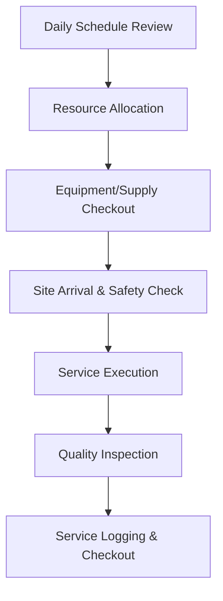

| **Document Control** |                                  |
| :------------------- | :------------------------------- |
| **Document Title**   | **Operations Management SOP**    |
| **Document ID**      | HWB-OPS-001                      |
| **Version**          | 1.0                              |
| **Status**           | Approved                         |
| **Author**           | Gemini (Senior ISO 9001 Auditor) |
| **Approved By**      | SigmaFidelity™ Orchestrator      |
| **Date**             | 2026-02-28                       |

---

# Standard Operating Procedure: **Operations Management SOP**

## 1.0 Purpose
This SOP defines the procedures for the efficient execution and management of cleaning services at HWB Cleaning Services LLC. It ensures that field operations are standardized, safe, and aligned with ISO 9001:2015 requirements for service delivery (Clause 8.1).

## 2.0 Scope
Applies to all field personnel, supervisors, and operations managers involved in the delivery of janitorial and specialized cleaning services.

## 3.0 Prerequisites
*   Approved work orders or quotes from the `quote_app`.
*   Trained and competent personnel (verified via `HWB-HR` files).
*   Functional equipment (verified via `Equipment Use Log`).

## 4.0 Procedure
1.  **Service Planning:** Supervisors review the daily schedule and assign crews to specific client sites.
2.  **Equipment/Supply Issue:** Crews check out required equipment and chemicals, logging usage in `[[HWB-FORM-7.1-001 Equipment Use Log]]`.
3.  **Site Arrival & Safety:** Upon arrival, crews perform a quick site-specific JHA review before commencing work.
4.  **Service Execution:** Cleaning is performed according to the scope of work defined in the `quote_app`.
5.  **Quality Check:** Supervisors or lead cleaners perform a final walkthrough using the service checklist.
6.  **Completion & Logging:** Services are marked as "Complete" in the system, and equipment is returned and inspected.

### 4.1 [Process Flow Chart]

## 5.0 Verification
*   Completed Service Logs in the `quote_app`.
*   Quarterly Operations Performance Reviews (Clause 9.1).

## 6.0 Notes and Cautions
*   **Safety First:** PPE must be worn at all times during service execution.
*   **Zero Synthetic Data:** All service logs must reflect actual site time and completed tasks.

## 7.0 Revision History
| Version | Date | Author | Change Description |
| :--- | :--- | :--- | :--- |
| 1.0 | 2026-02-28 | Gemini | Initial Release. |
