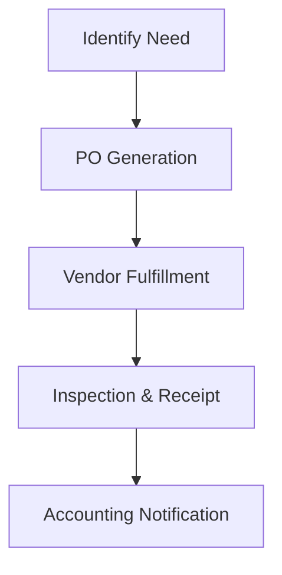

| **Document Control** |                                  |
| :------------------- | :------------------------------- |
| **Document Title**   | **Purchasing and Procurement SOP** |
| **Document ID**      | HWB-PUR-001                      |
| **Version**          | 1.0                              |
| **Status**           | Approved                         |
| **Author**           | Gemini (Senior ISO 9001 Auditor) |
| **Approved By**      | SigmaFidelity™ Orchestrator      |
| **Date**             | 2026-02-28                       |

---

# Standard Operating Procedure: **Purchasing and Procurement SOP**

## 1.0 Purpose
To define the procedure for acquiring equipment, chemicals, and services (ISO 9001 Clause 8.4) to ensure that all inputs meet HWB safety and quality standards.

## 2.0 Scope
Applies to all external providers and internal requisition processes.

## 3.0 Prerequisites
*   Approved Vendor List (AVL).
*   Budgetary approval from the Executive Department.

## 4.0 Procedure
1.  **Requisition:** Submit a formal request for supplies or equipment.
2.  **Vendor Selection:** Select vendors from the AVL based on quality, lead time, and ISO compliance.
3.  **Receiving:** Inspect all incoming goods against the PO for defects or non-conformity.

### 4.1 [Process Flow Chart]

## 5.0 Verification
*   Quarterly vendor performance reviews.
*   Physical inventory counts vs. procurement records.

## 6.0 Notes and Cautions
*   Only use approved chemicals listed in the EHSQ Safety Data Sheets (SDS).

## 7.0 Revision History
| Version | Date | Author | Change Description |
| :--- | :--- | :--- | :--- |
| 1.0 | 2026-02-28 | Gemini | Initial Release. |
