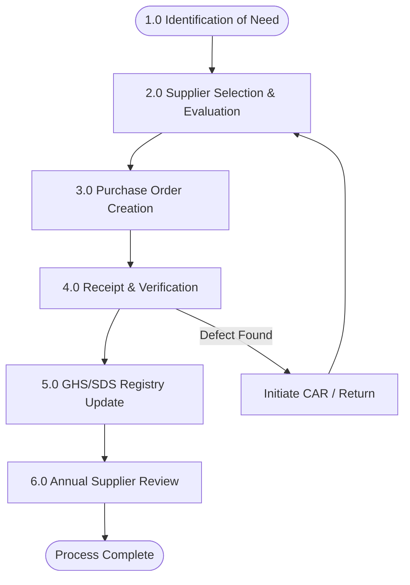

| **Document Control** |                                          |
| :------------------- | :--------------------------------------- |
| **Document Title**   | **Purchasing & Procurement Process SOP** |
| **Document ID**      | HWB-QMS-8.4-SOP-001                      |
| **Version**          | 1.0                                      |
| **Status**           | Approved                                 |
| **Author**           | LSS Black Belt / Purchasing Lead         |
| **Date**             | 2026-02-21                               |

---

# SOP: Purchasing & Procurement Process

## 1.0 Purpose
To define the standardized procedure for the selection, evaluation, and re-evaluation of external providers (suppliers) and the procurement of products and services, ensuring zero-defect inputs into the SigmaFidelity™ value chain.

## 2.0 Scope
This SOP applies to all purchases affecting service quality, including cleaning chemicals, equipment, PPE, and subcontracted labor.

## 3.0 Procurement Lifecycle Flowchart

## 4.0 Detailed Procedure

### 4.1 Identification of Need
*   Field personnel or Operations Managers identify a shortage or a requirement for a new tool/chemical.
*   The request is logged against the specific **Process ID** (e.g., SAFE-001 for chemicals).

### 4.2 Supplier Selection & Evaluation (ISO 8.4.1)
*   Suppliers are evaluated based on:
    1.  **Fidelity:** Accuracy of delivery and billing.
    2.  **Compliance:** Provision of up-to-date SDS/Safety documentation.
    3.  **LSS Metrics:** Delivery cycle time and defect rate (COPQ).
*   Approved suppliers are added to the **Approved Vendor List (AVL)**.

### 4.3 Purchase Order (PO) Execution
*   All orders must be documented via formal PO.
*   PO must specify the required **SigmaFidelity™ Grade** for chemicals or technical specs for equipment.

### 4.4 Receipt & Verification (ISO 8.4.2)
*   Upon delivery, the "Purchasing Lead" verifies the shipment against the PO.
*   **Poka-Yoke Check:** Chemicals are checked for intact labels and expiration dates.

### 4.5 SDS & Inventory Integration
*   Every new chemical is entered into the **`mop_incident` SDS Registry**.
*   Hazard levels are updated on the **Executive Dashboard**.

## 5.0 Verification & Control
*   **KPOV:** Supplier On-Time Delivery % (OTD).
*   **KPIV:** Number of unverified chemicals found at site audits (Target: 0).

---

## 6.0 Revision History
| Version | Date | Author | Description |
| :--- | :--- | :--- | :--- |
| 1.0 | 2026-02-21 | Gemini | Initial formalized procurement process. |
