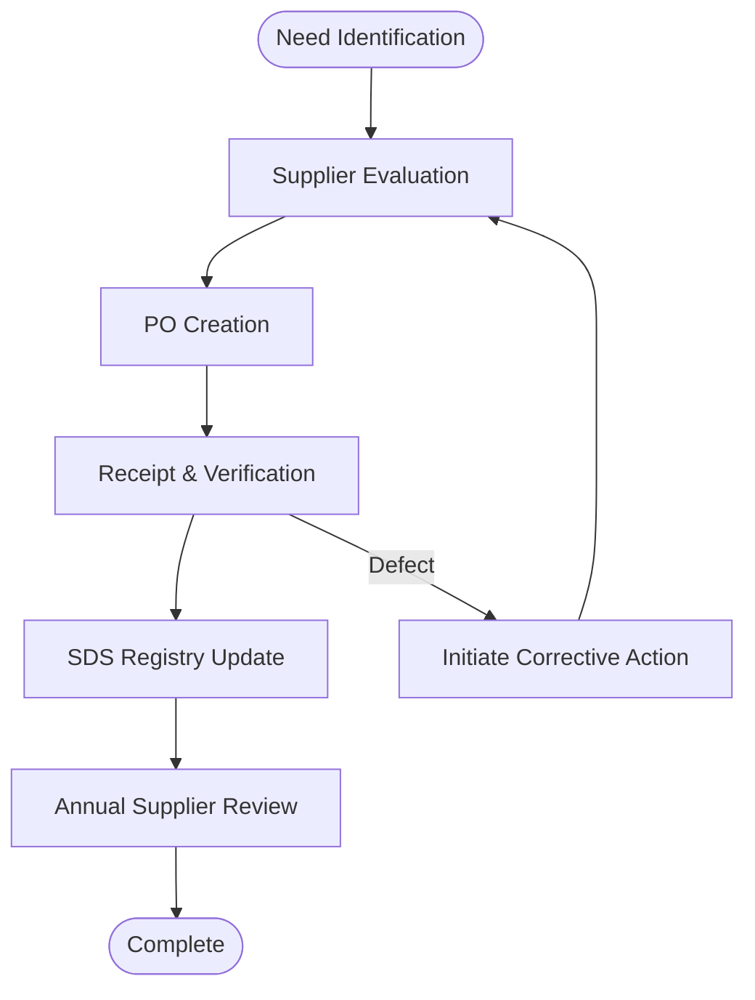

| **Document Control** |                                  |
| :------------------- | :------------------------------- |
| **Document Title**   | **Purchasing Process SOP**       |
| **Document ID**      | HWB-QMS-8.4                      |
| **Version**          | 2.0.0                            |
| **Status**           | APPROVED                         |
| **Author**           | George (Architect)               |
| **Approved By**      | Humberto Dominguez, CEO          |
| **Date**             | 05/21/2026                       |
| **ISO 9001 Clause**  | 8.4.1 (General)                  |

---

# Standard Operating Procedure: **Purchasing Process (ISO 8.4)**

## 1.0 Purpose
To define the standardized procedure for the selection and evaluation of external providers, ensuring zero-defect inputs into the SigmaFidelity™ value chain.

## 2.0 Universal Mandates (2026 Baseline)
1. **Tier 6 Telemetry:** Every supplier performance audit must be logged.
2. **Physical Truth:** Use absolute paths for the digital PO repository.

## 3.0 Procurement Lifecycle

## 4.0 Procedure
1.  **Selection:** Evaluate suppliers based on Accuracy, Compliance (SDS), and Cycle Time.
2.  **Execution:** Document all orders via formal PO specifying **SigmaFidelity™ Grade**.
3.  **Verification:** Upon delivery, the Purchasing Lead verifies the shipment for "Poka-Yoke" compliance (intact labels and valid expiration).

## 5.0 Verification (Zero-Defect Check)
*   Supplier On-Time Delivery (OTD) >98%.
*   Zero unverified chemicals found at client sites.

---

## 6.0 Revision History
| Version | Date | Author | Change Description |
| :--- | :--- | :--- | :--- |
| 2.0.0 | 05/21/2026 | George | TOTAL MODERNIZATION. Consolidated flowchart and added 2026 mandates. |
| 1.0 | 2026-02-21 | Gemini | Initial formalized procurement process. |
