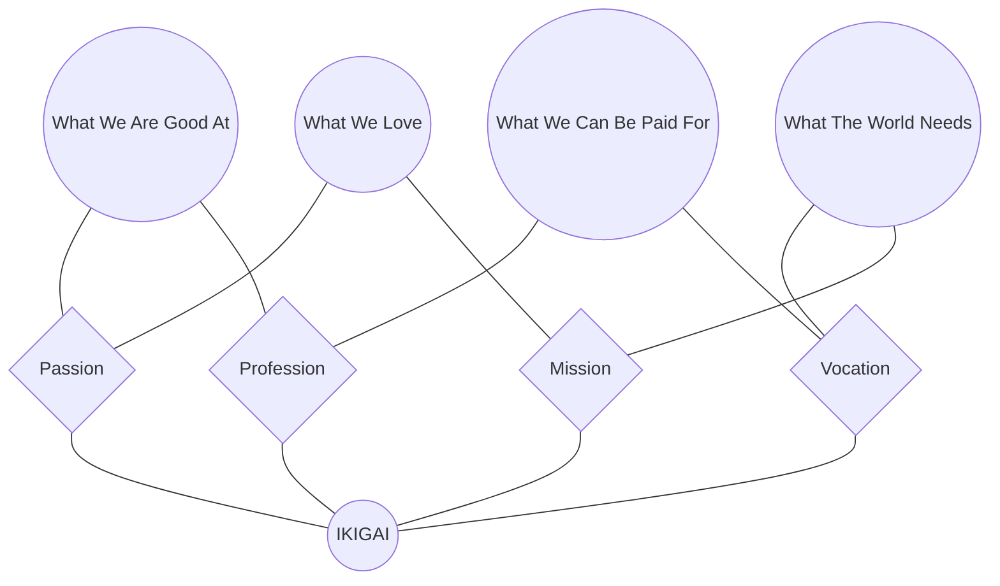

| **Document Control** |                                   |
| :------------------- | :-------------------------------- |
| **Document Title**   | **Ikigai Business Alignment SOP** |
| **Document ID**      | HWB-QMS-1.1                       |
| **Version**          | 2.0.0                             |
| **Status**           | APPROVED                          |
| **Author**           | George (Architect)                |
| **Approved By**      | Humberto Dominguez, CEO           |
| **Date**             | 05/21/2026                        |
| **ISO 9001 Clause**  | 4.1 (Context of Organization)     |

---

# Standard Operating Procedure: **Ikigai Business Alignment**

## 1.0 Purpose
This SOP defines the business alignment of HWB Cleaning Services LLC through the Ikigai framework. It establishes the intersection of corporate passion, expertise, market needs, and revenue streams to ensure strategic focus under the **SigmaFidelity™** protocol.

## 2.0 Universal Mandates (2026 Baseline)
1. **The Operator Charter:** Strictly industrial execution—zero synthetic data.
2. **Guidance First:** Any strategic shift in business alignment requires CEO guidance.
3. **Tier 6 Telemetry:** Strategic alignment reviews must be logged to the Tactical DB.

## 3.0 Ikigai Definition

### 3.1 What We Love (Passion & Mission)
*   The pursuit of **SigmaFidelity™** (Zero-defect infrastructure).
*   The synergy between autonomous AI orchestration and physical service excellence.

### 3.2 What We Are Good At (Passion & Profession)
*   **ISO 9001:2015** auditing and quality governance.
*   High-precision software engineering and agent orchestration.
*   Clinical-grade commercial and industrial sanitation.

### 3.3 What The World Needs (Mission & Vocation)
*   Transparent, data-verified facility management in the DFW metroplex.
*   High-fidelity reporting that eliminates the "Zero-Cost Illusion" of traditional janitorial services.

### 3.4 What We Can Be Paid For (Profession & Vocation)
*   Recurring high-ticket commercial cleaning contracts.
*   Specialized post-construction and data center decontamination.
*   SaaS-based manual modernization for industrial clients (Project BabySOP).

## 4.0 Alignment Visualization

## 5.0 Verification (Zero-Defect Check)
*   Annual alignment review during the Management Review Meeting.
*   100% of new projects map to at least three Ikigai intersection points.

## 6.0 Revision History
| Version | Date | Author | Change Description |
| :--- | :--- | :--- | :--- |
| 2.0.0 | 05/21/2026 | George | TOTAL MODERNIZATION. Added 2026 Baseline and Tier 6 mandates. |
| 1.0 | 2026-03-03 | Gemini | Initial Release. |
