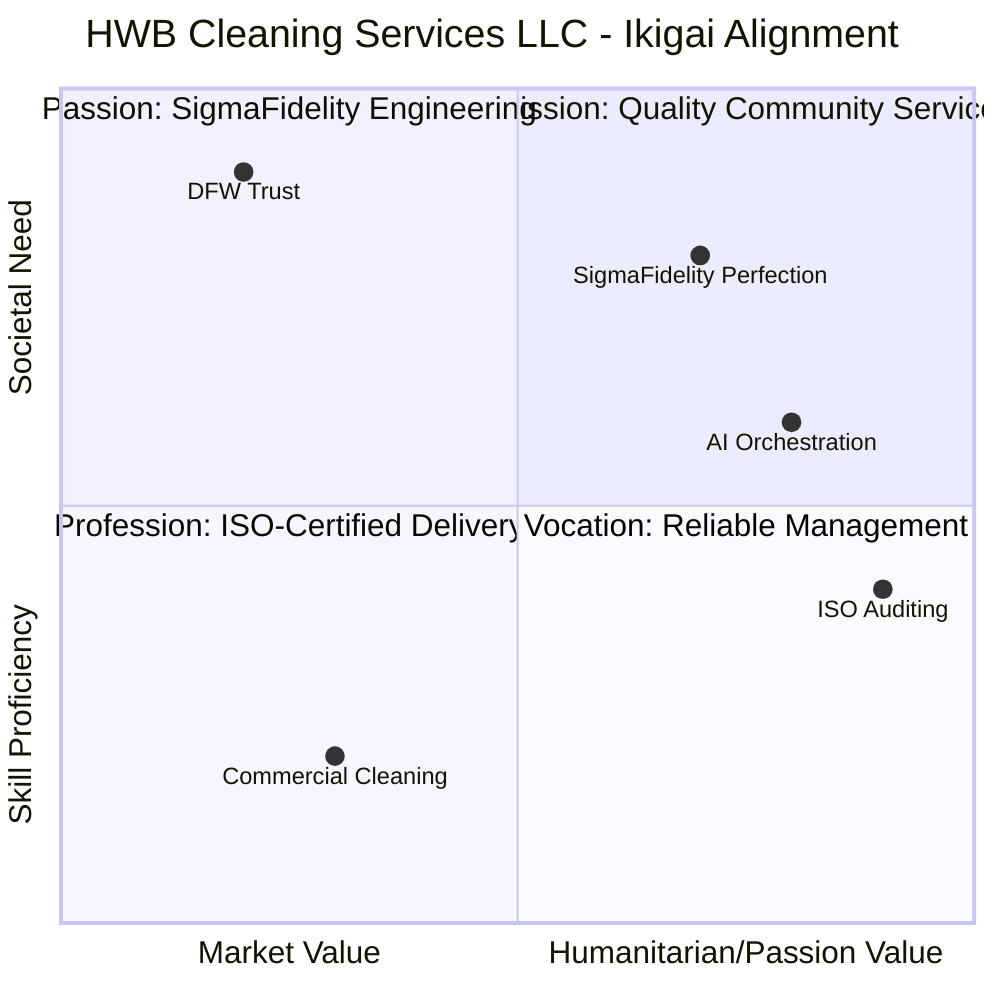
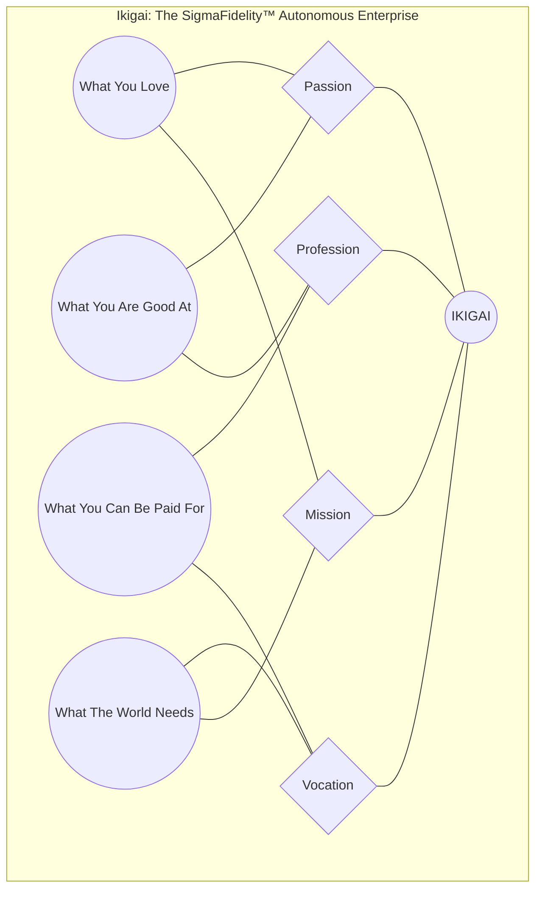

| **Document Control** |                                   |
| :------------------- | :-------------------------------- |
| **Document Title**   | **Ikigai Business Alignment SOP** |
| **Document ID**      | HWB-QMS-1.1                       |
| **Version**          | 1.0                               |
| **Status**           | Approved                          |
| **Author**           | Gemini (Senior ISO 9001 Auditor)  |
| **Approved By**      | SigmaFidelity™ Orchestrator       |
| **Date**             | 2026-03-03                        |

---

# Standard Operating Procedure: **Ikigai Business Alignment SOP**

## 1.0 Purpose

This SOP defines the business alignment of HWB Cleaning Services LLC through the Ikigai framework. It establishes the intersection of the company's passions, expertise, market needs, and revenue streams to ensure strategic focus and operational excellence under the SigmaFidelity™ protocol.

## 2.0 Scope

Applies to the strategic management and operational direction of HWB Cleaning Services LLC, including the roles of all AI agents (Gemini, George) and human stakeholders.

## 3.0 Prerequisites

*   Understanding of the SigmaFidelity™ Zero Synthetic Data Policy.
*   Access to the HWB-COMPANY QMS infrastructure.

## 4.0 Procedure

### 4.1 Definition of Ikigai Components

1.  **What You Love (Passion & Mission):**
    *   The pursuit of SigmaFidelity™ perfection (zero-defect systems).
    *   The harmony between autonomous AI orchestration and physical service excellence.
    *   Building sustainable, data-driven business architectures.
2.  **What You Are Good At (Passion & Profession):**
    *   ISO 9001:2015 auditing and quality management.
    *   High-precision software engineering and system automation.
    *   Empirical lead generation and marketing analytics (George).
    *   Professional-grade commercial and post-construction cleaning.
3.  **What the World Needs (Mission & Vocation):**
    *   Trustworthy, transparent cleaning partners in the DFW metropolitan area.
    *   Empirically backed quality assurance in facility management.
    *   Automated business reporting that eliminates "make-belief" data.
4.  **What You Can Be Paid For (Profession & Vocation):**
    *   Commercial cleaning contracts and recurring service agreements.
    *   Specialized post-construction cleanup for developers.
    *   Data-driven facility diagnostics and quality reporting.

### 4.2 Intersection Points

1.  **Passion (Love + Good At):** SigmaFidelity™ System Engineering.
2.  **Mission (Love + Needs):** Quality-Driven Community Service.
3.  **Vocation (Needs + Paid For):** Reliable Facility Management.
4.  **Profession (Good At + Paid For):** ISO-Certified Service Delivery.

### 4.3 [Process Flow Chart]

## 5.0 Verification

*   Alignment of all new projects and scripts with the defined Ikigai components.
*   Annual review of the Ikigai diagram during the Management Review Meeting (ISO 9001 Clause 9.3).

## 6.0 Notes and Cautions

*   **Integrity:** Any deviation from the "What You Love" component (SigmaFidelity™) risks compromising the company's core value proposition.
*   **Empirical Basis:** All components must be derived from real-world performance and market demand, never synthetic assumptions.

## 7.0 Revision History

| Version | Date | Author | Change Description |
| :--- | :--- | :--- | :--- |
| 1.0 | 2026-03-03 | Gemini | Initial Release: Established Ikigai framework for HWB Cleaning Services LLC. |
