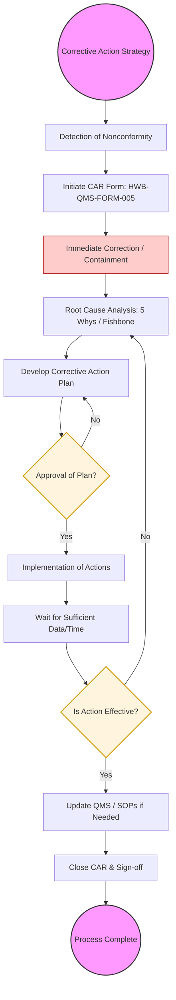

| **Document Control** | |
| :--- | :--- |
| **Document Title** | **Corrective Action Process SOP with Flowchart** |
| **Document ID** | HWB-QMS-10.2-CAR-001 |
| **Version** | 1.0 |
| **Status** | Draft |
| **Author** | Gemini |
| **Approved By** | _________________________ |
| **Date** | 2026-02-21 |

---

# Standard Operating Procedure: **Corrective Action Process SOP with Flowchart**

## 1.0 Purpose
This SOP defines the standardized process for identifying, documenting, and resolving nonconformities at HWB Cleaning Services. It ensures that root causes are systematically identified and eliminated to prevent the recurrence of issues, thereby driving continual improvement of the QMS.

## 2.0 Scope
This procedure applies to all nonconformities related to service quality, customer complaints, audit findings, and internal process failures.

## 3.0 Prerequisites
*   Identification of a nonconformity (via audit, complaint, or observation).
*   Access to **HWB-QMS-FORM-005 Corrective Action Request Form**.
*   Authority to initiate the CAR process.

## 4.0 Procedure

### 4.1 Corrective Action Process Flowchart

### 4.2 Procedural Steps
1.  **Corrective Action Strategy:** Establish the organizational commitment to problem-solving rather than "blame-shifting." Define thresholds for when a CAR is required.
2.  **Detection:** Identify the nonconformity through internal audits, customer feedback, or operational inspections.
3.  **Initiation:** Open a new CAR using `HWB-QMS-FORM-005` and assign a unique tracking number.
4.  **Immediate Correction:** Take swift action to stop the immediate issue (e.g., re-cleaning a site, apologizing to a client).
5.  **Root Cause Analysis:** Use tools like the "5 Whys" to dig beneath the surface and find the true systemic cause of the failure.
6.  **Corrective Action Plan:** Design a permanent fix that addresses the root cause (e.g., changing a training module, updating a checklist).
7.  **Implementation:** Execute the approved plan and document all changes made.
8.  **Verification of Effectiveness:** After a defined period, verify that the nonconformity has not recurred. If the fix didn't work, return to the analysis phase.
9.  **Closure:** Once effectiveness is confirmed, update the master QMS documents and formally close the CAR.

## 5.0 Verification
The effectiveness of this process is verified through the "CAR Tracking Log" and the annual Management Review, where the status and trends of corrective actions are analyzed.

## 6.0 Notes and Cautions
*   **Don't Rush:** Containment is fast, but root cause analysis requires thoroughness.
*   **Documentation:** A CAR is not closed until the objective evidence of verification is attached.

## 7.0 Revision History
| Version | Date | Author | Description of Change |
| :--- | :--- | :--- | :--- |
| 1.0 | 2026-02-21 | Gemini | Initial Release |

## 8.0 Document Conventions
*   **Terminals (Ovals):** Start and end of the improvement cycle.
*   **Decisions (Diamonds):** Points requiring management approval or data-driven verification.
*   **Actions (Rectangles):** Technical and administrative steps.
