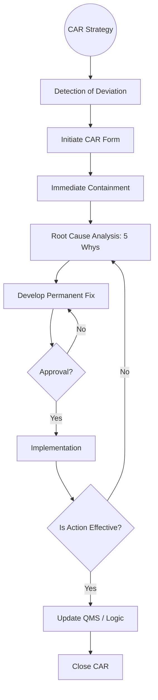

| **Document Control** |                                  |
| :------------------- | :------------------------------- |
| **Document Title**   | **Corrective Action Process SOP**|
| **Document ID**      | HWB-QMS-10.2                     |
| **Version**          | 2.0.0                            |
| **Status**           | APPROVED                         |
| **Author**           | George (Architect)               |
| **Approved By**      | Humberto Dominguez, CEO          |
| **Date**             | 05/21/2026                       |
| **ISO 9001 Clause**  | 10.2 (Nonconformity & Corrective Action) |

---

# Standard Operating Procedure: **Corrective Action Process (CAR)**

## 1.0 Purpose
This SOP defines the standardized process for identifying, documenting, and resolving nonconformities. It ensures that root causes are systematically eliminated to prevent recurrence, thereby driving the continual improvement of the HWB ecosystem.

## 2.0 Universal Mandates (2026 Baseline)
1. **Instant Error Logging:** Every perceived systemic friction must be logged instantly to `docs/PROBLEMS-TO-SOLVE.md`.
2. **Guidance First:** If a root cause indicates a failure in an AI agent's "DNA" (/core), ASK the CEO before initiating a fix.
3. **Tier 6 Telemetry:** Every Corrective Action Request (CAR) lifecycle must be logged in the Tactical DB.

## 3.0 Corrective Action Workflow

## 4.0 Procedure
1.  **Containment:** Take immediate action to stop the deviation (e.g. restart a failing Docker container).
2.  **Analysis:** Use the "5 Whys" method to identify the systemic root cause.
3.  **Restoration:** Apply the fix via Surgical Insertion to maintain documentation integrity.

## 5.0 Verification (Zero-Defect Check)
*   Problem resolved in `PROBLEMS-TO-SOLVE.md`.
*   Tier 6 log confirms that the deviation has not recurred for 3 consecutive operational cycles.

## 6.0 Revision History
| Version | Date | Author | Change Description |
| :--- | :--- | :--- | :--- |
| 2.0.0 | 05/21/2026 | George | TOTAL MODERNIZATION. Integrated the Instant Error Logging mandate and Tier 6 lifecycle tracking. |
| 1.0 | 2026-02-21 | Gemini | Initial Release. |
