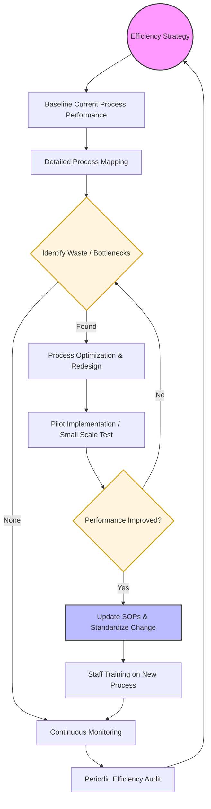

| **Document Control** | |
| :--- | :--- |
| **Document Title** | **Process Efficiency SOP with Flowchart** |
| **Document ID** | HWB-QMS-4.4-EFF-001 |
| **Version** | 1.0 |
| **Status** | Draft |
| **Author** | Gemini |
| **Approved By** | _________________________ |
| **Date** | 2026-02-21 |

---

# Standard Operating Procedure: **Process Efficiency SOP with Flowchart**

## 1.0 Purpose
This SOP defines the standardized approach for identifying, analyzing, and improving the efficiency of core business processes at HWB Cleaning Services. It aims to reduce waste, minimize errors, and optimize resource utilization to enhance overall service quality and profitability.

## 2.0 Scope
This procedure applies to all operational and administrative processes within the scope of the QMS, including service delivery, procurement, and billing.

## 3.0 Prerequisites
*   Access to process performance data (e.g., time logs, supply usage reports).
*   Defined Process Maps for the areas under review.
*   Baseline KPIs (Key Performance Indicators).

## 4.0 Procedure

### 4.1 Process Efficiency Flowchart

### 4.2 Procedural Steps
1.  **Efficiency Strategy:** Set high-level goals for optimization (e.g., "Reduce supply waste by 10%" or "Shorten billing cycle by 2 days").
2.  **Baselining:** Gather current data to understand the existing performance levels before any changes are made.
3.  **Process Mapping:** Document the "as-is" steps of the process to visualize hand-offs and delays.
4.  **Waste Identification:** Look for the "8 Wastes" (e.g., defects, overproduction, waiting, unused talent, transportation, inventory, motion, extra-processing).
5.  **Optimization:** Redesign the process to remove non-value-added steps.
6.  **Pilot:** Test the new process in a controlled environment to verify improvements without disrupting the entire operation.
7.  **Standardization:** If successful, formally update the relevant SOPs and master documents in accordance with section 7.5.
8.  **Training:** Ensure all relevant personnel are trained on the new, efficient workflow.
9.  **Continuous Monitoring:** Use automated tools or manual checks to ensure efficiency gains are sustained.

### 4.3 Computational Process Efficiency (SigmaFidelity™ Standard)
In alignment with the **Operational Velocity Mandate [2026-04-29]**, all AI Agent operations must adhere to the **5-Point Velocity Plan** to minimize "token drag" and maximize response agility:
1.  **Native Tool Prioritization:** Use `grep_search` and `glob` native tools to leverage `.geminiignore` for high-speed file discovery.
2.  **Autonomous Delegation:** Offload high-volume research or batch processing to sub-agents to maintain a lean primary session context.
3.  **Surgical Filtering:** Apply strict `start_line` and `end_line` parameters during file reads to minimize unnecessary data ingestion.
4.  **Institutional Cache Utilization:** Query established master logs (`PROBLEMS-TO-SOLVE.md`) and memory files before initiating exploratory research.
5.  **Parallel Turn Minimization:** Bundle independent tool calls into single conversational turns to reduce cumulative latency.

## 5.0 Verification
Process efficiency is verified through monthly KPI reports comparing current data against the established baselines and through quarterly internal audits.

## 6.0 Notes and Cautions
*   **Quality Balance:** Efficiency must never come at the expense of service quality or employee safety.
*   **Engagement:** Involve the employees who perform the tasks in the redesign phase; they often have the best insights into bottlenecks.

## 7.0 Revision History
| Version | Date | Author | Description of Change |
| :--- | :--- | :--- | :--- |
| 1.0 | 2026-02-21 | Gemini | Initial Release |

## 8.0 Document Conventions
*   **Terminals (Ovals):** Start of the strategy and the point of continuous feedback.
*   **Decisions (Diamonds):** Analytical checkpoints for performance or waste identification.
*   **Actions (Rectangles):** Implementation and documentation tasks.
