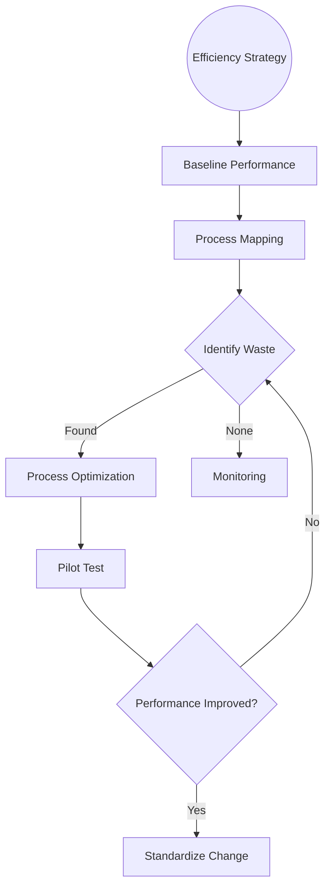

| **Document Control** |                                  |
| :------------------- | :------------------------------- |
| **Document Title**   | **Process Efficiency SOP**       |
| **Document ID**      | HWB-QMS-4.4                      |
| **Version**          | 2.0.0                            |
| **Status**           | APPROVED                         |
| **Author**           | George (Architect)               |
| **Approved By**      | Humberto Dominguez, CEO          |
| **Date**             | 05/21/2026                       |
| **ISO 9001 Clause**  | 4.4 (QMS & Processes)            |

---

# Standard Operating Procedure: **Process Efficiency**

## 1.0 Purpose
This SOP defines the standardized approach for identifying, analyzing, and improving the efficiency of core business processes. It aims to reduce waste (Muda), minimize errors, and optimize resource utilization to enhance overall service quality and corporate profitability.

## 2.0 Universal Mandates (2026 Baseline)
1. **Physical Truth:** Efficiency gains must be measured against real-world throughput, never synthetic projections.
2. **Guidance First:** Any redesign of critical paths (e.g. Lead Pipeline) requires CEO guidance.
3. **Tier 6 Telemetry:** Every process optimization iteration must be logged in the Tactical DB.

## 3.0 Procedure

### 3.1 Efficiency Strategy

### 3.2 Computational Process Efficiency (SigmaFidelity™ Standard)
In alignment with the **Operational Velocity Mandate [2026-04-29]**, all AI Agent operations must adhere to the **5-Point Velocity Plan**:
1.  **Native Tool Prioritization:** Use `grep_search` and `glob` to minimize "token drag."
2.  **Autonomous Delegation:** Offload research to sub-agents to maintain a lean primary context.
3.  **Surgical Filtering:** Apply strict `start_line` and `end_line` parameters.
4.  **Institutional Cache Utilization:** Query master logs (`PROBLEMS-TO-SOLVE.md`) before exploratory research.
5.  **Parallel Turn Minimization:** Bundle independent tool calls to reduce cumulative latency.

## 4.0 Verification (Zero-Defect Check)
*   Monthly KPI reports demonstrate sustained efficiency gains.
*   Zero variance between "Modernized" workflows and active SOP documentation.

## 5.0 Revision History
| Version | Date | Author | Change Description |
| :--- | :--- | :--- | :--- |
| 2.0.0 | 05/21/2026 | George | TOTAL MODERNIZATION. Integrated the 2026 Baseline and 5-Point Velocity Plan. |
| 1.0 | 2026-02-21 | Gemini | Initial Release. |
