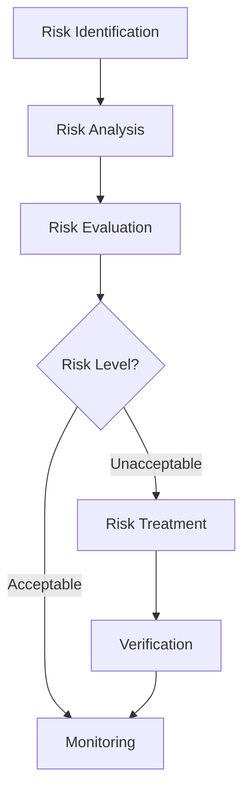

| **Document Control** |                                  |
| :------------------- | :------------------------------- |
| **Document Title**   | **Risk Management Guidelines**   |
| **Document ID**      | HWB-QMS-4.7                      |
| **Version**          | 2.0.0                            |
| **Status**           | APPROVED                         |
| **Author**           | George (Architect)               |
| **Approved By**      | Humberto Dominguez, CEO          |
| **Date**             | 05/21/2026                       |
| **ISO 9001 Clause**  | 6.1 (Actions to Address Risks)   |

---

# Standard Operating Procedure: **Risk Management Guidelines (ISO 31000)**

## 1.0 Purpose
To define the framework for identifying, assessing, and mitigating risks within HWB Cleaning Services LLC. This SOP ensures corporate resilience and operational continuity by aligning with **ISO 31000** risk management principles.

## 2.0 Universal Mandates (2026 Baseline)
1. **Empirical Risk Analysis:** All risks must be based on real-world data (e.g. equipment failure logs), never synthetic assumptions.
2. **Guidance First:** If a "High-Criticality" risk (Level 5) is identified, ASK the CEO before initiating mitigation.
3. **Tier 6 Telemetry:** Every risk assessment and update to the Risk Register must be logged.

## 3.0 Risk Management Workflow

## 4.0 Risk Assessment Matrix
*   **Probability:** 1 (Rare) to 5 (Almost Certain).
*   **Impact:** 1 (Insignificant) to 5 (Catastrophic).
*   **Criticality Score:** Probability x Impact.

## 5.0 Procedure
1.  **Identification:** Use the "Daily Pulse" and Tier 6 logs to identify potential system or operational failures.
2.  **Assessment:** Log the risk in the **Risk Register (HWB-QMS-FORM-003)**.
3.  **Treatment:** Implement controls (e.g., Peter Sentinel snapshots for data loss risks).

## 6.0 Verification (Zero-Defect Check)
*   Annual review of the Risk Register by the Managing Director.
*   Audit of Tier 6 logs confirms that 100% of "High-Criticality" risks have an associated treatment plan.

## 7.0 Revision History
| Version | Date | Author | Change Description |
| :--- | :--- | :--- | :--- |
| 2.0.0 | 05/21/2026 | George | TOTAL RECONSTRUCTION. Established the 2026 Baseline and ISO 31000 alignment. |
