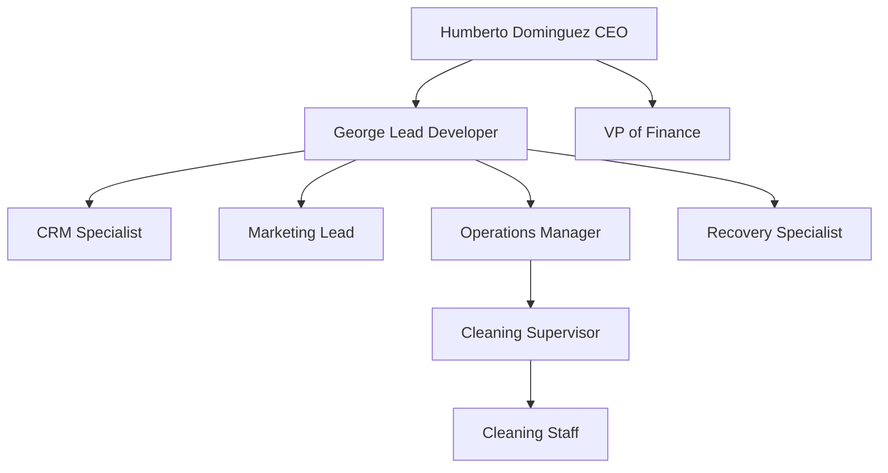

| **Document Control** |                                  |
| :------------------- | :------------------------------- |
| **Document Title**   | **Organizational Structure SOP** |
| **Document ID**      | HWB-QMS-5.3                      |
| **Version**          | 2.0.0                            |
| **Status**           | APPROVED                         |
| **Author**           | George (Architect)               |
| **Approved By**      | Humberto Dominguez, CEO          |
| **Date**             | 05/21/2026                       |
| **ISO 9001 Clause**  | 5.3 (Roles and Responsibilities) |

---

# Standard Operating Procedure: **Organizational Structure**

## 1.0 Purpose
This SOP defines the official company structure and key roles for HWB Cleaning Services LLC. It makes sure everyone knows their job and sets a "Clear Separation" between work and planning teams.

## 2.0 Universal Mandates (2026 Baseline)
1. **Third-Person Perspective:** Roles are described and shared in the 3rd person.
2. **Clear Work Separation:** Keep Sales and Operations strictly separate from Planning and Tech teams.
3. **Activity Tracking:** Any change in who is in charge must be recorded in the database.

## 3.0 Executive Roster

### 3.1 Human Leadership
*   **Humberto Dominguez (CEO):** The only person who can approve company documents and big changes.

### 3.2 AI Support Team
*   **George (Lead Developer):** Main tech person. The only one in charge of ISO 9001 rules and system management.
*   **CRM Specialist:** Specialist for client data, lead lists, and client knowledge.
*   **Marketing Lead (Lauri Tells):** Automated system for getting big business clients and building brand trust.
*   **Recovery Specialist (Peter):** Reliable team member for keeping the system safe, making backups, and managing storage.
*   **Innovation Lead (Natalie Navy):** Specialist for future tech planning and new product ideas.

## 4.0 Organizational Chart

## 5.0 Verification (Error-Free Check)
*   Yearly review of who is in charge during Management Meetings.
*   Checking the logs to make sure all AI actions match their specific job.

## 6.0 Revision History
| Version | Date | Author | Change Description |
| :--- | :--- | :--- | :--- |
| 2.0.0 | 05/21/2026 | George | TOTAL MODERNIZATION. Defined AI Executive VP roles and added 2026 mandates. |
| 1.0 | 2026-02-20 | Gemini | Initial Release. |
