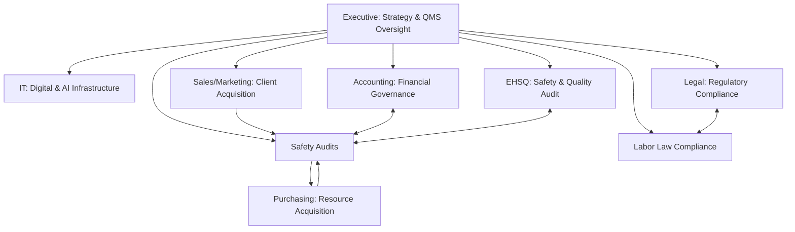

| **Document Control** |                                                    |
| :------------------- | :------------------------------------------------- |
| **Document Title**   | **Departmental Infrastructure and Governance SOP** |
| **Document ID**      | HWB-QMS-5.5                                        |
| **Version**          | 1.3                                                |
| **Status**           | Approved                                           |
| **Author**           | Gemini (Senior ISO 9001 Auditor)                   |
| **Approved By**      | SigmaFidelity™ Orchestrator                        |
| **Date**             | 2026-02-28                                         |

---

# Standard Operating Procedure: **Departmental Infrastructure and Governance SOP**

## 1.0 Purpose

This SOP defines the functional scope, responsibilities, and governance structure of the various departments within HWB Cleaning Services LLC. The objective is to ensure that all business activities are organized into clear, manageable units that support the Quality Management System (QMS) and align with ISO 9001:2015 requirements.

## 2.0 Scope

This procedure applies to all established departments at HWB Cleaning Services LLC, including Executive, Operations, Human Resources (HR), Information Technology (IT), and Environment, Health, Safety, and Quality (EHSQ).

## 3.0 Prerequisites

*   `[[HWB-QMS-MASTER Quality Management System Manual]]`
*   `[[HWB-SOP-002 Organizational Structure SOP]]`

## 4.0 Procedure

### 4.1 Executive Department
*   **Scope:** Strategic leadership, financial oversight, and QMS accountability.
*   **Key Responsibilities:**
    1.  Defining the Quality Policy and SMART Objectives.
    2.  Conducting Management Reviews (Clause 9.3).
    3.  Resource allocation and long-term business planning.
*   **Governance Folder:** `HWB-COMPANY/`

### 4.2 Operations Department
*   **Scope:** Service delivery, scheduling, and field execution.
*   **Key Responsibilities:**
    1.  Service planning and scheduling (Clause 8.1).
    2.  On-site cleaning execution and supervisor management.
    3.  Equipment use and maintenance logs (`[[HWB-OPS-001 Operations Management SOP]]`).
*   **Governance Folder:** `HWB-COMPANY/HWB-OPERATIONS/`

### 4.3 Human Resources (HR) Department
*   **Scope:** Recruitment, competence management, and personnel records.
*   **Key Responsibilities:**
    1.  Managing Employee Information Files (Clause 7.2).
    2.  Standardized Onboarding (`[[HWB-QMS-7.2 Employee Onboarding SOP]]`).
    3.  Training needs identification and record-keeping (`[[HWB-SOP-7.2-001 Employee Competence SOP]]`).
*   **Governance Folder:** `HWB-COMPANY/HWB-HR/`

### 4.4 Information Technology (IT) Department
*   **Scope:** Digital infrastructure, system uptime, and AI agent orchestration.
*   **Key Responsibilities:**
    1.  Webserver monitoring and uptime analytics (`[[HWB-QMS-9.1 Webserver Monitoring and Uptime Analytics SOP]]`).
    2.  AI Agent management (`[[HWB-QMS-9.2 AI Agents and Specialised Scripts SOP]]`).
    3.  Disaster Recovery and Restoration (`[[HWB-QMS-9.3 Disaster Recovery and Data Restoration SOP]]`).
    4.  Computer Security and Hardening (`[[HWB-QMS-9.4 Computer Security SOP]]`).
    5.  Data security and backup protocols.
*   **Governance Folder:** `HWB-COMPANY/HWB-IT/`

### 4.5 EHSQ (Environment, Health, Safety, and Quality) Department
*   **Scope:** Safety compliance, risk management, and quality auditing.
*   **Key Responsibilities:**
    1.  Job Hazard Analysis (JHA) management (`[[HWB-QMS-8.1-001 Job Hazard Analysis SOP]]`).
    2.  QMS internal audits (Clause 9.2).
    3.  Chemical safety and PPE compliance.
*   **Governance Folder:** `HWB-COMPANY/HWB-EHSQ/`

### 4.6 Accounting Department
*   **Scope:** Financial governance, invoicing, and payroll.
*   **Key Responsibilities:**
    1.  Accounts Payable and Receivable management.
    2.  Tax compliance and financial reporting.
    3.  Integration with `quote_app` for billing accuracy.
*   **Governance Folder:** `HWB-COMPANY/HWB-ACCOUNTING/`

### 4.7 Purchasing Department
*   **Scope:** Procurement of equipment and supplies (Clause 8.4).
*   **Key Responsibilities:**
    1.  Vendor evaluation and selection.
    2.  Purchase order management.
    3.  Inventory control and supply chain logistics.
*   **Governance Folder:** `HWB-COMPANY/HWB-PURCHASING/`

### 4.8 Legal Department
*   **Scope:** Regulatory compliance and contract management.
*   **Key Responsibilities:**
    1.  Contract review and liability mitigation.
    2.  Monitoring of labor and environmental laws.
    3.  Management of business permits and insurance.
*   **Governance Folder:** `HWB-COMPANY/HWB-LEGAL/`

### 4.9 Sales and Marketing Department
*   **Scope:** Client acquisition, brand management, and proposal generation.
*   **Key Responsibilities:**
    1.  Marketing strategy and brand evolution.
    2.  Sales pipeline and proposal management (`[[HWB-QMS-8.0 Sales Process SOP with Flowchart]]`).
    3.  Client onboarding and relationship management.
*   **Governance Folder:** `HWB-COMPANY/HWB-SALES-MARKETING/`

### 4.10 [Process Flow Chart]

## 5.0 Verification

*   Departmental folders must contain current SOPs and relevant forms.
*   Cross-departmental collaboration is verified through integrated records (e.g., JHA sign-offs in Personnel Files).

## 6.0 Notes and Cautions

*   Departments are functional units; however, the QMS is a single, integrated system.
*   All departmental data must adhere to the **Zero Synthetic Data Policy**.

## 7.0 Revision History

| Version | Date | Author | Change Description |
| :--- | :--- | :--- | :--- |
| 1.0 | 2026-02-28 | Gemini | Initial Release: Established departmental governance. |
| 1.1 | 2026-02-28 | Gemini | Added Accounting, Purchasing, and Legal departments. |
| 1.2 | 2026-02-28 | Gemini | Added Sales/Marketing, Operations folder, and refined governance mapping. |
| 1.3 | 2026-02-28 | Gemini | Added Computer Security SOP (HWB-QMS-9.4) to IT department. |

